# Computer NetWork


## 五层协议栈(自顶向下)
### 应用层
* 网络应用程序及应用层协议存留的地方
* 分布在多个端系统
* 主要协议: HTTP(80), SMTP, FTP(21), DNS(53)

### 传输层
* 提供在应用程序端点之间传送应用层报文的服务(进程间通信)
* 两个协议:
1. TCP: 提供`面向连接`的服务, 可靠, 流量控制       三次握手,四次挥手
2. UDP: 提供`无连接`的服务, 不可靠, 无流量控制

### 网络层
* 主机间通信
* IP协议

### 链路层
* 通过路由器进行分组(帧)转发
* 以太网, WiFi, 点对点协议

### 物理层
* 将帧中的每个比特从一个节点传输到下一个节点
* 具体协议与实际传输媒介相关(双绞线, 同轴电缆, 光缆, 空气)


---
## 关键点

### HTTP
* web的应用层协议
* 无状态: http服务器不保存关于客户端的任何信息

#### 非持久连接
* 一个页面中的多个对象分别通过不同的TCP连接进行传输,
* 即每个TCP连接只传输一个请求报文和响应报文,
* 服务器负担较重

#### 持久连接
* 服务器在响应后保持该TCP连接,
* 在相同客户端和服务器之间的后续请求和响应报文都通过相同的连接进行传送

#### http1.1
1. 默认持久连接
2. 管道化, 客户端可以同时发出多个请求, 而不用一个个等待响应.
3. 断点续传

#### http2.0
1. 采用二进制格式, 而非文本格式
2. 完全多路复用 --- 只需一个http连接就可以实现多个请求响应.
3. 报头压缩

#### 请求报文
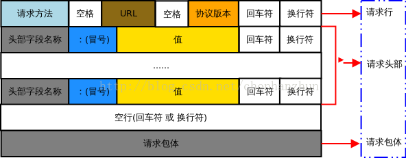
##### GET
```
GET /562f25980001b1b106000338.jpg HTTP/1.1
Host    img.mukewang.com
User-Agent  Mozilla/5.0 (Windows NT 10.0; WOW64) AppleWebKit/537.36 (KHTML, like Gecko) Chrome/51.0.2704.106 Safari/537.36
Accept  image/webp,image/*,*/*;q=0.8
Referer http://www.imooc.com/
Accept-Encoding gzip, deflate, sdch
Accept-Language zh-CN,zh;q=0.8
[空行]
[请求主体]
```
##### POST
```
POST / HTTP1.1
Host:www.wrox.com
User-Agent:Mozilla/4.0 (compatible; MSIE 6.0; Windows NT 5.1; SV1; .NET CLR 2.0.50727; .NET CLR 3.0.04506.648; .NET CLR 3.5.21022)
Content-Type:application/x-www-form-urlencoded
Content-Length:40
Connection: Keep-Alive

name=Professional%20Ajax&publisher=Wiley
```

#### 响应报文
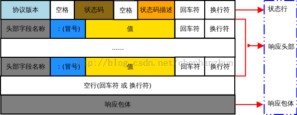
```
HTTP/1.1 200 OK
Date: Fri, 22 May 2009 06:07:21 GMT
Content-Type: text/html; charset=UTF-8

<html>
      <head></head>
      <body>
            <!--body goes here-->
      </body>
</html>
```

#### get/post的区别
1. get主要是从服务器上获取资源, 而post则是向服务器发送数据
2. get的请求参数是以key-value的形式放在url之后, 而post则是将要提交的数据放在报文的主体中.
3. get能向服务器传输的数据有限, post则可以传送大量的数据.
4. 通过get传送参数较不安全.

#### HTTP状态码
* 200: 请求成功
* 301: 永久转移, 新的URL在location首部行中指定. 浏览器会自动用新的URL获取对象
* 303: 查看其它位置, 资源可以在另一个url找到, 须使用get方法重新请求
* 400: 请求不能被服务器所理解
* 404: 所请求的文档不在服务器上
* 500: 服务器错误
* 503: 服务器不可用(超载,维护中)
* 505: 版本不支持, 服务器不支持请求报文使用的http版本

### DNS
* Domain Name Service (域名系统)
* 主机名到IP地址的转换, 分布式数据库
* DNS服务: 主机别名, 负载分配

#### DNS层级结构
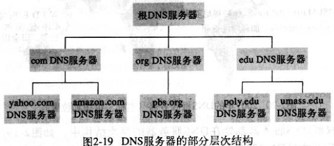
##### 根域名服务器
全球共13个根域名服务器

##### 顶级域名服务器
* 如 com, org, net, edu, gov 以及所有国家的顶级域名: cn, jp, uk, fr

##### 权威域名服务器
> 在英特网上具有公共可访问主机的每个组织机构都必须提供公共可访问的DNS记录, 由机构的权威域名服务负责保存.

##### 本地域名服务器
本地域名服务器严格上来说不属于DNS服务器的层次结构, 但是却对DNS结构有很重要的作用.
每个网络服务提供商(ISP)都会有一台本地的DNS服务器, 起着代理的作用负责将请求转发到DNS服务器的层次结构中.

#### DNS服务器的交互
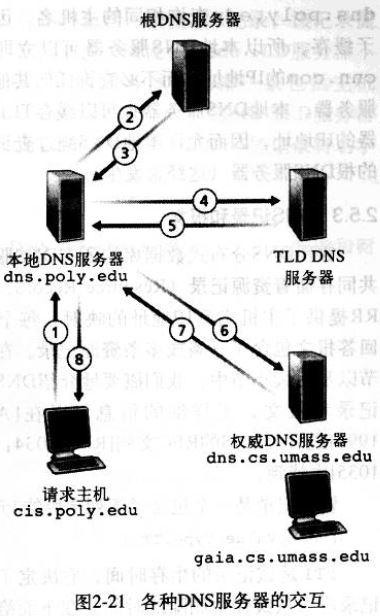
从请求主机到本地DNS服务器的查询是`递归查询`, 其余的则是`迭代查询`.


### UDP协议
* UDP只是做了传输层能够做的最少工作.
> 除了 **多路复用** / **多路分解** 及一些轻型的 **差错检测** 外, 几乎没对IP增加新的东西.
* UDP是**无连接**的: 在发送报文之前, 双方的传输层实体之间没有进行握手.

#### UDP校验和
* 发送方对报文段中的所有16bit的`和`进行`反码运算`, 求和时遇到的任何溢出都被回卷. 接收方在求和后不进行反码运算, 直接与发送方的校验和进行相加, 如果所有比特都为1则说明没有出错.

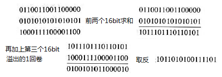


### UDP v.s. TCP
* UDP 不可靠, 但可以在应用层中自己实现可靠传输.
* UDP无拥塞控制和流量控制, 因此应用层能够更好地控制要发送的数据和发送的时间. 这也使得UDP对网络的友好性不如TCP
* UDP无需建立连接. 也就不会有建立连接时延
* UDP无连接状态, UDP不需要在端系统中维护接收发送`缓存`,`拥塞控制`参数,`序列号`与`确认号`等连接状态
* UDP分组首部开销小, TCP报文首部为20字节, 而UDP仅8个字节.


### TCP协议
#### 三次握手
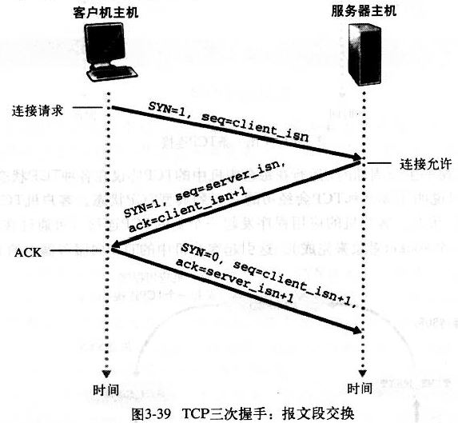
* 服务器收到客户端的SYN报文后就立即为该链接分配缓存和变量
* 客户端也是在收到服务器的SYN报文后才为链接分配缓存和变量
* hint: SYN报文指, 报文首部的SYN比特位为1的报文

#### 四次挥手
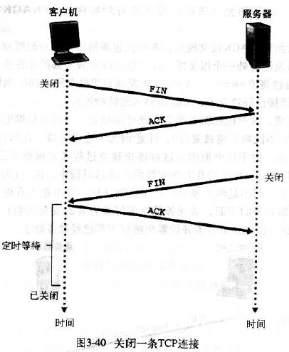

client向server发送FIN, 表示之后不会再有向server的请求(关闭从client到server的连接), **但是仍会接收server发送的数据**(没传完的).
在server向client的数据都传送完毕后, server向client发送FIN, 在收到client返回的确认后, 关闭从server到client的连接.

#### 可靠传输
* 三要素: 序列号, 确认号, 定时器

1. 累积确认(冗余ACK): 当收到接收方的确认报文时, TCP将ACK的值y与最早未被确认的字节序号SendBase进行比较: 如果y>SendBase则表面该ACK是在确认之前未被确认的一个或多个报文段, TCP更新SendBase; 如果当前还有未被确认的报文段, TCP还是要重新启动定时器.
2. 收方缓存: 接收方缓存收到的乱序报文段
3. 单一定时器: 当TCP从应用层收到数据时将其封装在一个报文段中然后交给网络层, 报文段的序号为第一个字节的字节流编号. TCP会为最早未被确认的报文段设置定时器(指数加权移动平均往返时延估计)
4. 选择重传: 当定时器超时后, TCP就会重传引起超时的报文, 并重启定时器. (如果收到3个冗余的ACK时会立刻重传对应的报文)

#### 流量控制
* 一个速度匹配服务, 将发送方的发送速率与接收方应用程序的速率相匹配, 以消除发送方使接收方缓存溢出的可能性.
##### 实现机制
给发送方发送ACK时, 同时告诉发送方剩余的缓存空间大小(RevWindow), 发送方将未确认的数据控制在RevWindow, 使得双方收发速度匹配.

#### TCP 拥塞控制
* 拥塞: 网络中的数据量超过了网络的承受能力
* 拥塞的两个表现: 丢包(3个冗余ACK), 延迟(计时器超时)
* 慢启动, 拥塞避免, 快恢复

* 加性增乘性减:
  每发送一个分段就将拥塞窗口(CongWin)增加一个分段的长度(MSS), 当检测到丢包时将拥塞窗口减半
  

* 慢启动
初始的拥塞窗口为1MSS, 但实际可用的网络带宽可能远大于当前传输速率(MSS/RTT), 为了尽快达到理想的传输速率, 将拥塞窗口按指数级增长(每次将拥塞窗口变为原来的2倍), 直到网络开始拥塞.

* ...
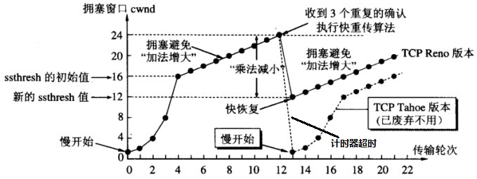
* 当收到3个冗余ACK时, 将ConWin减半, 然后线性增加;
* 当计时器超时时, 将ConWin重置为1然后指数增长, 在达到上一次超时窗口的一半时改为线性增长.

##### TCP的公平性
当有t个TCP连接共用一个带宽为R的链路时, 每个连接得到的带宽都是R/t
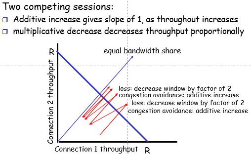

---
### socket(套接字)
* 进程和网络之间进行数据交换的`门户`. 传输层的数据并不是直接交付给进程, 而是通过套接字来传递: 根据报文中的特定字段确定报文所属的套接字
* 三种套接字: TCP套接字, UDP套接字, 原始套接字

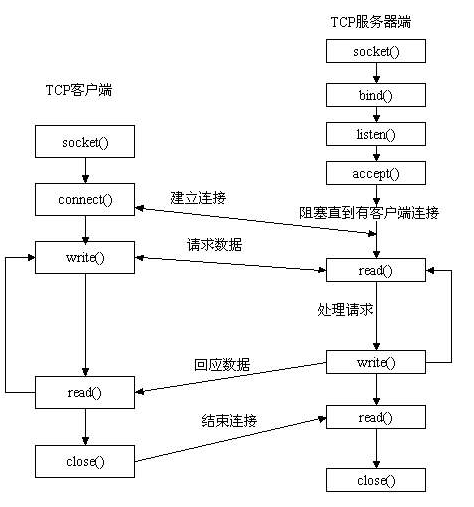

##### 套接字id即端口号??
* UDP套接字: 由一个包含**目的IP**和**目的端口号**的二元组标识. (无连接)
* TCP套接字: 由一个包含**目的IP**, **目的端口号**, **源IP** 和 **源端口号** 的四元组标识. (面向连接)

#### 多路复用与多路分解
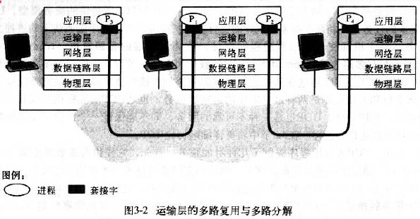
将网络层提供的`主机到主机`的服务扩展到为在主机上运行的应用程序提供的`进程到进程`的交付服务.

* 多路复用: (上到下)从不同套接字收集数据块,加上首部生成报文段,传递给网络层.
* 多路分解: (下到上)将传输层报文段中的数据交付到正确的套接字.


---
### 网页的请求过程
1. 通过DNS解析(递归查询/迭代查询)
2. 建立TCP连接(三次握手/四次挥手, http报文是包裹在tcp报文中的)
3. 通过http协议请求页面(GET/http状态码)
4. 浏览器显示页面
