## 操作系统结构
* 操作系统用户界面: 
1. 命令解释程序, 
2. 图形用户界面

### [系统调用]( http://blog.csdn.net/wj3319/article/details/7267553 ) 
> 系统调用提供了操作系统(内核)提供的有效**服务界面**(接口) 
* 用户程序可以通过系统调用来获得操作系统内核提供的服务. 
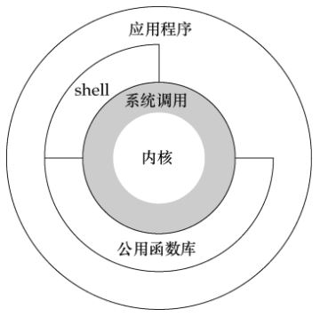

### api
* API 封装了系统调用的编程接口
> 通过API操作系统接口的许多细节被隐藏起来, 并被执行支持库所管理. 

### shell(外壳)
* 命令解释器
* shell 通常不必理解具体命令, 只需用命令来识别文件以装入内存执行即可. 命令对于shell来说只是一个文件名罢了. 

### 用户模式 & 内核模式
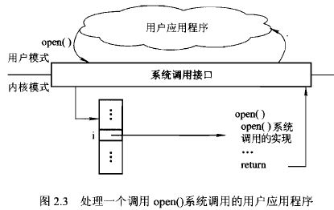

* linux的运行空间分为`内核空间与`用户空间`, 各自运行在不同级别中, 逻辑上相互隔离. 
* 这种隔离主要是为了实现对内核的保护, 因为内核中有许多敏感的操作一旦出错则会导致操作系统崩溃. 
* 用户程序, 通常情况下只能在用户空间操作用户数据和函数, 不允许访问内核数据和函数, 
* 但是很多时候, 用户程序需要获得操作系统提供的服务, 这时候, 就必须使用系统调用.
* 当一个应用程序执行系统调用而陷入内核代码中执行时, 就称进程处于内核运行模式(**内核态**);
* 而当一个进程在执行自己的代码时(没有执行系统调用时), 就称其处于用户运行模式(**用户态**)


---
## 进程通信(Inter-Process Communication)模式
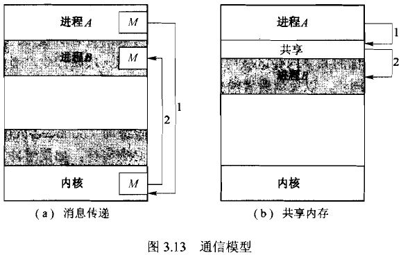

### 消息传递
* 通信进程间通过一个共同的邮箱来进行消息交换

#### 常见的进程通信方式

### 内存共享
* 协作进程间通过一块共享的内存区域来交换信息
* 生产者&消费者

##### pipe(无名管道)
* 单向的, 仅限于父子或兄弟进程之间使用, 只存在于内存中. 

> 管道是`单向的`, `先进先出`的, `无结构`的, `固定大小`的`字节流`, 它把一个进程的标准输出和另一个进程的标准输入连接在一起. 

#### FIFO(有名管道)
* 有路径名与之关联, 真实存在与文件系统中, 可以在无关进程之间通信. 

#### 消息队列
* 消息队列是消息的`链表`, 存在与内核中, 每个队列有唯一的标识符
* 消息有特定的`格式`和`优先级`
* 消息队列可以独立于进程而存在, 当进程终止时, 其中的消息并不会被删除
* 消息可以实现`随机查询`

#### Socket
> 更为一般的通信机制, 可用于不同机器之间的进程通信

#### 信号量
* 进程同步
* P V 操作

### 对比
* 消息传递, 没有冲突, 有利于交换少量数据, 计算机之间的通信
* 内存共享, 允许最大速度地通信, 便利, 保护和同步(死锁)
* 消息传递需要操作系统内核的介入, 而共享内存不需要


## 操作系统结构
### 简单结构
* MS-DOS
1. 没有很好区分接口和功能层次（应用程序能访问基本的I/O子程序）
2. 用户程序出错时整个系统崩溃

* 原始UNIX
1. 内核 + 系统程序

### 分层结构
1. 每层只能调用较低层的功能和服务
2. 每层为较高层隐藏了一定的数据结构、操作和硬件的存在
3. 简化了系统的设计和实现
4. 与其他方法相比效率较差

### 微内核
1. 将所有非基本部分从内核中移走，实现为系统程序或用户程序
2. 便于系统扩充（新服务在用户空间增加）
3. 更好的安全性和可靠性
4. 性能较低. 

### 模块化内核
1. 内核提供核心服务的同时也能动态的实现特定功能、
2. 模块之间可以相互调用，不需要消息传递来通信


---
# 进程管理
## 概念
### 进程
1. 执行中的程序
2. 包括：pc指针、堆、栈、数据段（如全局变量）、文本段

### 状态图
``` 
[new] --> [ready] <--I/O操作完成-- [wait] <--I/O等待-- [running] --退出--> [stop]
             | <-----------------------interupt<---------- |
             | ----------------------->schedule----------> |
```    

## 进程调度
### 调度队列
### 调度程序
* 进程通常先被提交到大容量存储设备的缓冲池中，
* 短期调度
从准备执行的进程中选择进程，并为之分配CPU
1. 执行频率较高
2. 对执行速度要求加高

* 长期调度
负责从缓冲池中选择进程装入内存以准备执行
1. 执行频率较低
2. 必须仔细选择装入内存的程序（为了达到最好性能，系统需要一个合理的I/O为主和CPU为主的进程组合）

* 中期调度
1. 将进程换出
2. 为了改善进程组合，或因内存要求的改变引起了可用内存的过度使用而需释放内存


### 上下文切换
* 保存当前进程的状态并回复另一个进程的状态，从而将CPU切换到另一个进程


## 线程
### 概念
* cpu使用的基本单元, 由线程ID、程序计数器、寄存器集合、栈 组成
* 与属于同一进程的其他线程共享代码段、数据段和其他操作系统资源(如信号,打开文件)
* 多线程编程：响应度高、资源共享、经济（线程的创建和切换比进程更经济）、充分使用多处理器体系结构
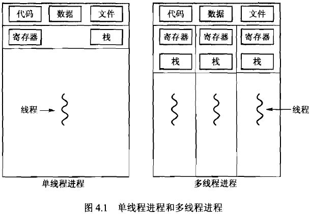


### 多线程模型 
<p> **用户线程** ：在用户层、受内核支持而无需内核管理 </p>
<p> **内核线程** ：在内核层、由操作系统直接支持和管理 </p>
* 多对一：多个用户线程对应一个内核线程，高效
* 一对一：每个用户线程对应一个内核线程，更好的并发功能，但是每创建一个用户线程就需要创建相应的内核线程
* 多对多：多路复用了许多用户线程到同样数量或更小数量的内核线程上

|   |   |   |
|:---|:---|:---|
| 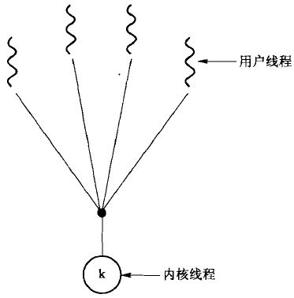 | 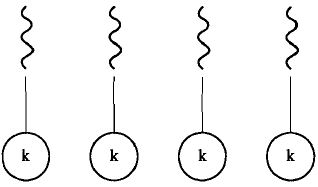 | 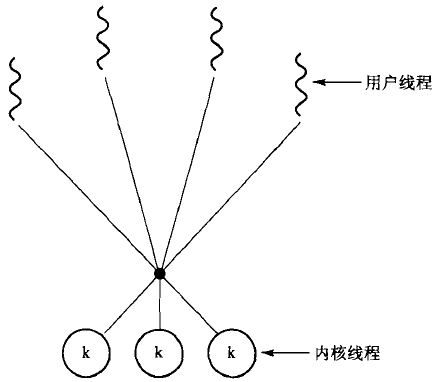 |

* 线程池
**在进程创建时就创建一定数量的线程放入池中等待工作，当进程收到任务时就唤醒池中的一个线程并为之分配任务**
1. 用已有线程处理请求要比等待创建新线程要快
2. 限制了任何时候可用线程的数量


## CPU调度
### 调度准则
* CPU使用率：使CPU尽可能忙
* 吞吐量：   单位时间内所完成的进程数
* 周转时间： 从进程提交到进程完成的时间
* 等待时间： 在就绪队列中所花费的时间之和
* 响应时间： 从提交请求到产生第一响应的时间

### 调度算法
1. 先到先服务（FCFS）
* 非抢占
* 平均等待时间较长

2. 最短作业优先（SJF）
* 运行时间短的先执行
* 平均等待时间最小
* 要提前知道进程的运行时间，难以做到
* 预测进程的运行时间：指数平均（Tao[n+1] = a*T[n] + (1-a)*Tao[n], 0<=a<=1）

3. 最短剩余时间优先（抢占式的SJF）
* 如果一个新到的进程比当前进程具有更短的CPU区间，则抢占当前进程

4. 优先级调度
* 每个进程关联一个优先级，优先级高的先执行
* 进程饥饿：因为优先级太低虽然可以运行但一直得不到CPU。可以逐渐增加在系统中等待很长时间的进程的优先级

5. 轮转法（Round-Robin）
* 类似于FCFS，每个进程一次最多执行一个时间片，
* 如果在一个时间片内没有执行完则会被强行放回就绪队列等待下一轮执行
* 时间片的选择：时间片太大则成了FCFS，太小则会因为频繁的上下文切换增加调度开销

6. 多级队列调度
* 将就绪队列分成多个独立队列，根据进程的属性将其永久地分配到一个队列
* 每个队列有自己的调度算法
* 队列之间再采用特定的方法进行调度，如固定优先级抢占调度、在队列之间划分时间片

7. 多级反馈队列调度
* 将就绪队列分成多个独立队列，每个队列有自己的调度算法
* 允许进程在不同队列之间移动
* 队列优先级越高进程每次得到的时间片越短，反之
* 如果进程占用过多CPU时间则将其转移到低优先级队列，如果在低优先级队列中等待太久则会被转移到高优先级队列中
* 最通用，最复杂


## [进程与线程的区别]( http://www.cnblogs.com/lmule/archive/2010/08/18/1802774.html )
* 进程是系统进行资源分配和调度的一个独立单元，线程是指令执行的基本单元(CPU调度和分派的基本单元)
* CPU分配给线程, 即真正在CPU上运行的是线程
* 一个线程只能属于一个进程,而一个进程可以由多个线程
* 同一进程的所有线程共享该进程的系统资源
* 多进程与多线程
  1. 相比于进程, 线程之间`切换`的消耗要小.
  2. 线程的`创建`与`销毁`的代价比进程要小.
  3. 多线程中一个线程出错将导致整个进程崩溃, 而多进程中进程间的相互影响要小很多.
  4. 多线程编程能有效提高程序的响应度, 提高系统的并发性, 能充分利用多处理器体系结构. 
  5. 多进程使用于多核,多机分布, 而多线程只适用于多核分布. 


---
# 进程同步

## 同步与互斥
### 同步 
多个进程(线程)为了合作完成任务, 必须严格按照规定的先后顺序运行
### 互斥 
对于系统中的某些资源, 一次只允许一个线程访问. 当一线程正在访问时其他线程必须等待. 

## 临界区问题
* 三个条件
1. 互斥：同一时刻最多只能有一个进程进入临界区
2. 前进：只有还没进入临界区的进程可以进入
3. 有限等待：不予许一个需要访问临界区的进程被无限延迟
* 有空让进，无空等待，择一而入，算法可行

## Peterson算法
* 经典的基于软件的临界区问题的解答
* 使用于两个进程在临界区与剩余区交替执行

## 硬件同步
* 原子指令：TestAndSet、 Swap

## 信号量
* 一个进程在某一特殊点上被迫停止直到收到一个对应的特殊变量值---信号量
* 原子操作 wait()（p操作）, signal()（v操作）
* wait，申请信号量(--)； signal，释放信号量(++)
* 信号量 >=0 时表示剩余的资源数， <0 时表示正在等待该资源的进程数

## 经典同步问题
### 有限缓冲(生产者消费者)

### 读者-写者问题

### 哲学家就餐问题


## 管程
一种编程思想，对资源的并发访问做一次封装，为的是解决信号量不正确的使用容易导致的错误。

## 原子事务
* 事务是访问且可能更新各种驻留在磁盘文件中的数据项的**程序单元**

### 基于日志的恢复
* 先记日志后操作
* 在将相应日志记录写出到稳定存储之前不允许真正的更新数据
* 恢复算法：redo、undo；redo已经commits的，undo还没commits的

### 检测点
* 为了降低恢复时的时间耗费

### 并发原子操作
* 冲突可串行化调度：可以通过一系列非冲突操作的交换转换成串行调度的调度
* 加锁协议：
 *共享锁*：只可读
 *排它锁*：可读写
1. 两阶段加锁协议：
 *增长阶段*：只能获取锁不能释放锁；*收缩阶段*：只能释放锁不能获取锁
 **确保了冲突可串行化，但不能避免死锁**
2. 时间戳顺序协议：
 o 为每个事务关联一个*固定的*时间戳
 o 通过时间戳决定串行化的顺序
 o 如果事物由于read和write操作被回滚，则赋予其新的时间戳重新开始
 **确保了冲突可串行化，能够避免死锁**

 
---
# 死锁 
## 必要条件
* 互斥：至少有一个资源处于非共享模式
* 持有并等待：持有一定资源并等待另一资源
* 非抢占：持有的资源只能在进程完成后自动释放
* 循环等待：p0等待p1持有的资源，p1等待p2持有的资源...，pn等待p0持有的资源

## 资源分配图
* 申请边
* 分配边

## 死锁处理方法
* 通过协议预防或避免死锁，确保系统不会进入死锁状态
* 允许系统进入死锁状态，但能恢复
* 忽略死锁，不做任何处理


## 死锁预防
*确保至少一个必要条件不成立*
1. 持有并等待 
 o 每个进程在执行前申请并获得所有资源
 o 在申请更多资源之前，必须先释放已有的所有资源
**资源利用率较低，进程饥饿**

2. 非抢占 
 o 如果一个进程占有资源并申请另一个不能立即分配的资源，则其现已分配的资源都可被抢占
**只适用于状态可以保持和恢复的资源，如CPU、内存**

3. 循环等待 
 o 对所有资源类型进行完全排序
 o 要求每个进程按递增顺序申请资源

 
## 死锁避免
### 安全状态

### 资源分配图算法 

### 银行家算法
* 当进程进入系统时先说明需要的每种资源的最大数量
* 当用户申请一组资源时，系统必须确保这些资源的分配是否会使系统处于安全状态
* 数据结构
 1. Available: 每种资源现有的实例数量
 2. Max: 每个进程对每种资源的最大需求
 3. Allocation: 每个进程已获得的各种资源的实例数量
 4. Need: 每个进程还需要的资源
* 编程实现

## 死锁检测 
* 每种资源类型只有单个实例
 o 判断等待图中是否有环（n^2)
 o 等待图---资源分配图中删除资源节点
* 每种资源类型有多个实例
 o 类似银行家算法 

## 死锁恢复
1. 进程终止
 o 一次终止所有死锁进程
 o 一次终止一个进程直到死锁循环消失
2. 资源抢占
 o 逐步从进程中抢占资源给其他进程使用 


---
# 内存管理
## ...
* 逻辑地址：CPU所生成的地址
* 物理地址：内存单元所看到的地址（即加载到内存地址寄存器中的地址）
* 内存管理单元：负责运行时逻辑地址到物理地址的映射

* 重定位寄存器：物理地址 = 逻辑地址 + 重定位寄存器
* 界限地址寄存器：逻辑地址 < 界限地址寄存器


* 动态加载：一个子程序只有在调用时才被加载

* 动态链接：
* 共享库：

* 交换：将进程从内存交换到备份存储上，当需要执行时再调回内存中

## 连续内存分配
### 可变分区（动态存储分配）
* 操作系统维护一张表，用于记录内存的使用情况
* 当有新的进程需要内存时，为该进程查找足够大的空闲空间（hole）
* 适配方案：
1. 首次适配：分配第一个足够大的孔
2. 最佳适配：分配最小的足够大的孔，产生最小剩余孔
3. 最差适配：分配最大的孔，产生最大剩余孔（最大剩余孔可能比最小剩余孔更有用）

* 碎片
1. 外部碎片
 o 由于太小而无法分配给任何进程的空闲空间
 o 虽然总和可以满足申请需求，但是由于不连续使得操作系统无法满足当前申请
2. 内部碎片
 o 已经分配出去却不能被利用的存储空间
 o 因为分配给进程的空间大于其所需要的空间

## 分页（paging）
### 基本方法
* 将物理地址分为固定大小的块---**帧**；将逻辑地址也分为同样大小的块---**页**
* 使得进程使用的物理地址可以是非连续的
* 实现用户视角的内存和实际物理内存的分离
* 通过地址转换硬件实现用户视角的内存到实际物理内存的转换
* 可以共享公共代码

#### 页面大小的选择
* linux的页大小通常为4k, 
* 太小: 页表会比较大, 
* 太大:
 1. 导致大量内部碎片, 
 2. 内存碎片(外部碎片), 在系统运行了很长时间后, 会很难找到大小合适的连续内存块, 使得内存分配效率下降,
 3. 在进行页面置换时需要换出的内存页越大, 影响性能

### 地址转换
* 地址由*页号*和*页内偏移*两部分组成（页号 = 逻辑地址/页大小， 页内偏移 = 逻辑地址%页大小）
* 页号作为页表中的索引（帧号 = Table(页号)）
* 通过页表将页号转换为帧号，帧号与页内偏移构成物理地址（物理地址 = 帧号*页大小+页内偏移）

### 内存保护
* 为每个帧关联一个保护位
* 有效-无效位
 o 有效时表示相关的页在进程的逻辑地址空间内，是合法的页
 o 无效时表示不在逻辑地址空间内，是非法的

### 页表结构
#### 层次页表（向前映射页表）
* 为了解决页表过大的问题

* 两级页表
对页表再分页，将页号再细分为页码和页偏移


#### 哈希页表
* 32位处理器处理超过32位地址空间的常用方法
* 每个页表条目包含一个链表
* 链表的每个元素包含三个域：(1)虚拟页码、(2)所映射的帧号、(3)指向下一个元素的指针
* 算法工作方式；
    通过哈希函数根据逻辑地址中的页号计算出虚拟地址中的页号，
根据虚拟页号索引哈希表，并用逻辑地址中的页号与链表中每个元素的第一个域相比，
如果匹配就用相应的帧号来形成物理地址，否则比较下一个节点

#### 反向页表
* 为了解决通常情况下页表太大的问题
* 整个系统只维护一个页表，每个物理内存中的页只有一条相应的条目
* 逻辑地址分为process-id、page-number、offset三部分
* 页表每个条目为一对<process-id,page-number>，第i个条目对应物理内存的第i页
* 根据逻辑地址中的process-id和page-number匹配页表中的条目，如果匹配到了第i条，则对应的物理地址为<i,offset>
 
## 分段（segmentation）
* （或许可以理解为可变的页）
* 每个程序由许多不同的段组成
* 段表，每个条目由*段基地址*和*段界限*组成
* 逻辑地址由*段号*和*偏移*组成
* 通过段号查找段表，如果偏移小于段界限则对应的物理地址为段基地址+偏移


---
# 虚拟内存
## 背景
* 特点
 o 进程中所有存储器访问都是逻辑地址，而逻辑地址只有在运行时才转换为物理地址
 o 一个进程可以划分许多块，但是在执行过程中，这些块并不需要连续地位于主存中
* 效果
 o 可以在主存中保留多个进程
 o 进程可以比主存的全部空间还大（将大逻辑地址空间映射到小物理内存）

## 按需调页（demand paging）
* 只有在程序执行需要时才载入页，而那些从未访问的页不会载入到内存
 o I/O需求更少
 o 内存需求更少
 o 响应更快
 o 能够同时容纳更多进程
* 有效-无效位
 o 有效时表示相关的页在内存中
 o 无效时表示相关的页不在内存中
* 页面错误
1. 对标记为无效的页的访问时会产生页错陷入
2. 处理过程
 o 如果是非法的地址访问则终止进程
 o 否则访问磁盘将所需的也调入内存，更新进程的内部表和页表，并重新开始因陷入而中断的指令
 
* 有效访问时间（effective access time）
>> (1-p) * 内存访问时间 + p * 处理页错误所需时间   （p为页错误的概率）

* 写时拷贝（copy on write）
父进程与子进程开始时共享同一页面（标记为写时拷贝页），只有在某一个进程要对页面进行写操作时才为其创建共享页的副本。
空闲页从空闲缓冲池获取。

### 页面置换
* 当没有空闲帧时，如何处理缺页错？ 
释放当前没有使用的帧，再载入所需的页。这会使得页错误的处理时间加倍。
可以通过使用修改位或脏位来降低额外开销：为每个页关联一个修改位，当页面被修改时将对应修改位置1，
之后当该页被选为替换页时就可以通过修改位来决定是否需要先将其写入硬盘。

#### 页面置换算法
1. FIFO
* 总是淘汰最先调入的页
* 因为最早调入内存的页面，其不再访问的可能性最大
* 实现简单、适合线性访问、对其他情况效率不高
* 会出现分配给进程的页面增多，缺页次数反而增多的情况
```
引用串    
          7  0  1  2  0  3  0  4  2  3
页帧
           7  7  7  2     2  2  4  4  4  
           n  0  0  0     3  3  3  2  2
           n  n  1  1     1  0  0  0  3      
```

2. 最优置换
* 淘汰距现在最长时间后再访问的页
* 不是实际可行的算法，衡量各种具体算法的标准
```
引用串    
          7  0  1  2  0  3  0  4  2  3
页帧       
           7  7  7  2     2     2       
           n  0  0  0     0     4       
           n  n  1  1     3     3       
```

3. LRU置换
* 淘汰在最近一段时间里较久未被使用的页
* 根据程序局部性原理，那些刚被使用过的页面，可能马上还要被使用，而在较长时间里未被使用的页面，可能不会马上使用到。
```
引用串    
          7  0  1  2  0  3  0  4  2  3
页帧       
           7  0  1  2  2  2  2  4  4  4    
           n  7  0  1  1  3  3  3  2  2    
           n  n  7  0  0  0  0  0  0  3    
```

4. 时钟策略
* 每帧关联一个使用位
* 页第一次调入内存时，使用为置为1
* 当页随后被访问到时使用位也置为1
* 当置换页发生时查找使用位为0的帧
* 置换检索过程中将为1的使用位置为0

### 帧分配策略
* 固定：全局置换，允许进程从另一个进程中拿到帧
* 动态：局部置换，要求每个进程只能从自己分配到的帧中进行选择

## 系统颠簸(thrashing)
* 进程在换页上的时间多于执行时间
* 
```
cpu使用率下降 ---> 引入更多进程 ---> 更多缺页错 ---> 更长的换页时间 
    | <-------------------------------------------------- | 
```
* 局部模型
o 进程执行时，它从一个局部移向另一个局部
o 一个程序由多个不同局部组成，并且局部之间可能重叠

* 工作集合模型

* 页错误频率
o 为所期望的页错误设置上限和下限，如果进程的实际页错误率超过上限则为其分配更多帧，如低于下限则移走帧

---	
# 文件系统接口
* 文件是记录再外存上的相关信息的具有名称的集合
* 文件被命名后，就独立于进程、用户甚至创建它的系统
* 属性：名称、标识符、类型、位置、大小...
* 所有文件信息都保存在目录结构中，而目录结构也保存在外存上
* 操作系统维护一个包含所有打开文件的信息表，当需要一个文件操作时可通过该表的一个索引指定文件

## 目录结构
1. 单层目录结构
* 所有文件都包含在同一目录中
* 便于理解和支持
* 随着文件数量的增加，难以记住所有文件名； 会在不同用户之间引起文件名的混淆
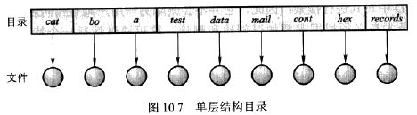

2. 双层目录结构
* 每个用户都有自己的用户文件目录
* 有效的对用户加以隔离，但不利于用户之间文件的共享
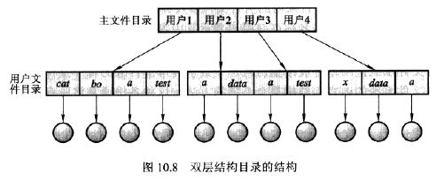

3. 树状结构目录
* 绝对路径名：从根开始并给出路径上的目录名直到所指定的文件
* 相对路径名：从当前目录开始定义路径
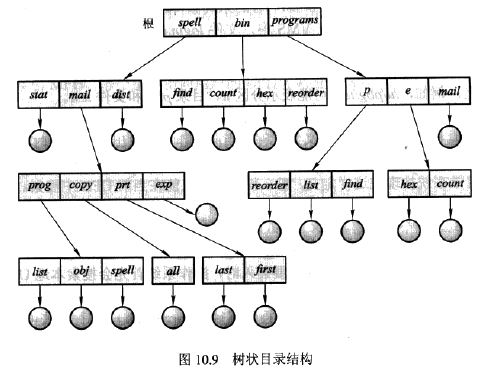

4. 无环图目录
* 树状结构的扩展
* 允许共享同一文件或子目录出现在两个不同目录中
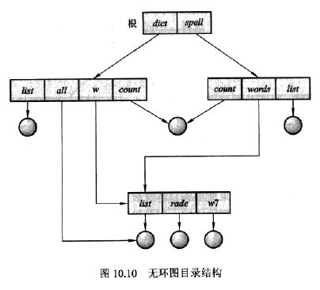


## 文件系统安装

## 文件共享
### 多用户
* 用户类型
o 拥有者：文件的拥有者，是目录最高控制权的用户
o 组：对文件拥有相同权限的用户子集
o 其他：系统内其他用户
* 一个目录或文件的拥有者ID和组ID与其他文件属性一起保存，当用户请求文件操作时通过检查其ID就可以知道是否拥有相应权限。

### 远程文件系统
* ftp
* 分布式文件系统
* 浏览器


* 客户机-服务器模型
* 分布式信息系统

* 访问控制
为每个文件和目录增加一个*访问控制列表*，以给定每个用户名及其所允许的访问类型。
将访问控制方法与用户、组和其他成员访问控制方案结合使用。


---
# 文件系统实现
## 文件系统结构
* 分层结构：应用程序 -> 逻辑文件系统 -> 文件组织系统 -> 基本文件系统 -> I/O控制 -> 设备
* 文件控制模块(FCB)
包含文件的信息，如拥有者、权限、文件内容的位置

## 文件系统实现 
### 虚拟文件系统(VFS)
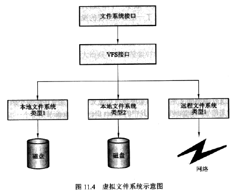
* 第一层：文件系统接口，向操作系统提供文件系统的通用操作（open()/read()/write()/close()）
* 第二层：虚拟文件系统层
1. 通过VFS接口将文件系统的通用操作和具体实现分开
2. 提供在网络上位于表示一个文件的机制

### 目录实现（目录分配和管理算法） 
* 线性列表
通过一个线性列表保存存储文件名和数据库指针
编程简单但运行费时

* 哈希表
在线性链表的基础上增加哈希数据结构
通过哈希表将文件名映射到列表索引，极大地减少目录搜索时间
哈希冲突的避免

## 磁盘空间分配方法
* 连续分配
每个文件在磁盘上占有一组连续的块
用第一块磁盘的地址和连续块的数量来定义一个文件
便于顺序访问和直接访问 
难以为新文件找到空间、外部碎片、文件大小不易改变

* 连接分配 
每个文件是磁盘块的链表
目录中保存文件的第一块的指针和最后一块的指针
没有外部碎片
文件大小可以动态增长
只能顺序访问、不利于直接访问 
指针需要额外空间
可靠性低

o 文件分配表（FAT）
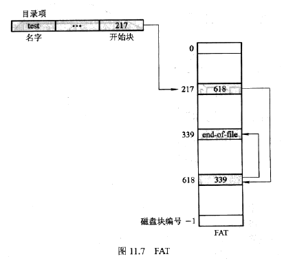

* 索引分配
通过索引块保存文件的所有块指针，第i个条目直线文件的第i块，
目录中保存文件名和对应的索引块的地址
支持直接访问，没有外部碎片，文件大小可动态扩展
性能欠缺
索引块大小不易确定
大文件的存储：
o 链接方案：将多个索引块链接
o 多次索引：第一层索引块执行一组第二层索引块，第二层索引块再指向文件块
o 组合方案
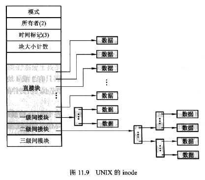


## 空闲空间管理
* 位向量
每块用一位表示，1表示空闲、0表示已分配
查找磁盘第一个空闲块和n个连续空闲块时相对高效

* 链表
将所有空闲块用链表链接（类似链接分配）
不需要额外的空间保存链表 
当遍历链表时需要读入每一块，效率不高 

* 组
将所有空闲块的地址保存在第一个空闲块中（类似索引分配）


---
# 大容量存储器(磁盘)的结构
## 磁盘
* 磁臂
* 磁道 
* 扇区 
* 柱面 
* 传输速率 
* 随机访问时间 = 寻道时间 + 旋转等待时间
 o 寻道时间：移到磁臂到所要柱面的时间
 o 旋转等待时间：等待所要扇区旋转到磁臂下面的时间

## 磁盘结构 

## 磁盘附属 
* 主机附属存储
计算机通过I/O端口访问磁盘
* 网络附属存储
计算机通过分布式文件系统的远程主机访问磁盘

## 磁盘调度 
* FCFS 调度 

* SSTF(Shortest-Seek-Time-First)（最短寻道时间优先）
优先选择距离当前磁头位置最近的待处理请求
可能会导致一些请求得不到服务
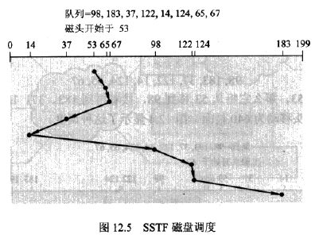

* SCAN 调度 （电梯算法）
磁臂从磁盘的一端向另一端移动，同时当磁头移动过每个柱面时，处理位于该柱面上的服务请求。
当到达另一端时磁头改变处理方向继续处理（必须到达另一端才能反向）
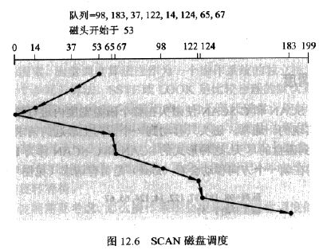

* C-SCAN 调度（circular SCAN）
磁头从一端移到另一端，随着移动不断处理请求，
当到达另一端时，马上返回，返回时不处理请求
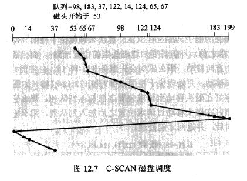

* LOOK调度 && C-LOOCK调度
与SCAN和C-SCAN类似，只是磁头移动到一个方向上最远的请求时即可掉头
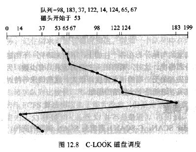

## 磁盘管理 
### 磁盘格式化 
* 低级格式化（物理格式化）
为磁盘的每个扇区采用特殊的数据结构
* 操作系统格式化
o 将磁盘分为由一个或多个柱面组成的分区
o 将初始的文件系统数据结构存储到磁盘（逻辑格式化）


## 交换空间管理
当物理内存的数量达到临界低点，就需要将进程(最不活跃的)从内存移到*交换空间*以释放内存空间


## RAID 结构（磁盘冗余阵列）
* 通过冗余改善可靠性
* 通过并行处理改善性能
数据分散
o 位级分散：在多个磁盘上分散每个字节的各个位。如有8个磁盘，将每个字节的第i位写到第i个磁盘上
o 块级分散：对于n个磁盘，一个文件的第i块存储在第(i mod n)+1 个磁盘上


---
# I/O输入系统
## I/O硬件
* 总线：
一组`线`（一个或多个设备共同使用的线）和一组严格定义的可以描述在线上传输信息的`协议`
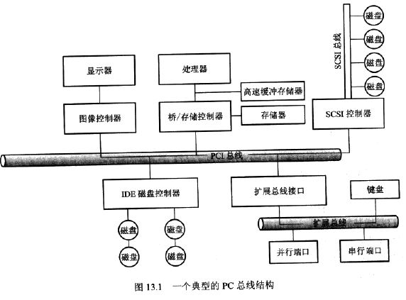

* 轮询(polling)
主机不断的读取设备的状态

* 中断(interrupt)：
CPU硬件有一条`中断请求线`，cpu在执行完每条指令后都会检测中断请求线。当收到中断请求时，cpu将保存当前状态并跳转到中断处理程序。中断处理程序判断中断原因进行必要处理，然后执行中断返回指令使cpu返回中断以前的状态。
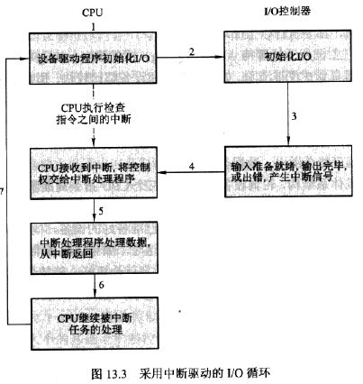

* 直接内存访问(DMA)
通过DMA控制器避开cpu直接在内存和外设之间传递数据
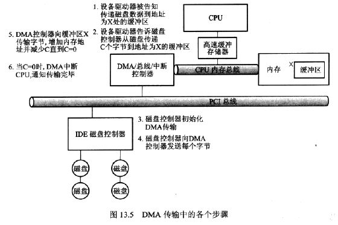


## I/O应用接口
* 设备驱动程序 
为内核I/O子系统隐藏设备控制器之间的差异


* 缓冲区 
1. 处理数据流的生产者和消费者之间的速度差异
2. 协调传输数据大小不一致的设备
3. 复制语义 

* 高速缓存(cache) 


