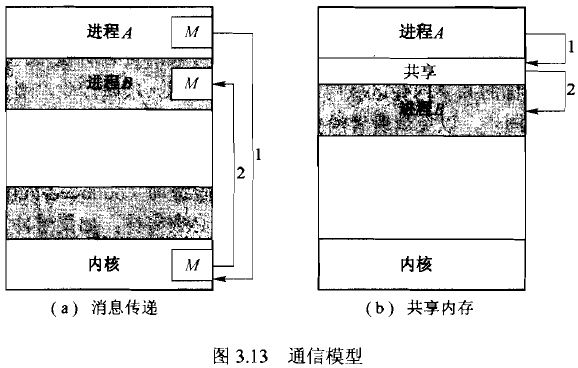
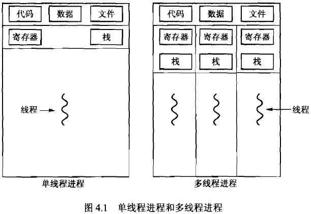
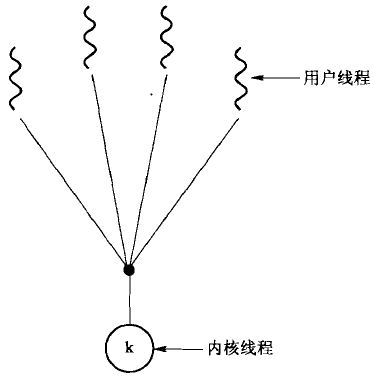

* 什么是操作系统?
操作系统控制和协调各个用户应用程序对硬件资源的使用.
资源分配, 进程管理.

---
## 进程通信(Inter-Process Communication)模式


### 内存共享
* 协作进程间通过一块共享的内存区域来交换信息
* 需要依靠某种同步机制来达到进程见的同步及互斥
* 生产者&消费者

### 消息传递
* 通信进程间通过一个共同的邮箱来进行消息交换

#### 常见的进程通信方式

##### pipe(无名管道)
* 单向的, 仅限于父子或兄弟进程之间使用, 只存在于内存中.

> 管道是`单向的`, `先进先出`的, `无结构`的, `固定大小`的`字节流`, 它把一个进程的标准输出和另一个进程的标准输入连接在一起.

#### FIFO(有名管道)
* 有路径名与之关联, 真实存在与文件系统中, 可以在无关进程之间通信.

#### 消息队列
* 克服了管道传递信息量少, 缓冲区大小受限等不足
* 消息队列是消息的`链表`, 存在与内核中, 每个队列有唯一的标识符
* 消息有特定的`格式`和`优先级`
* 消息队列可以独立于进程而存在, 当进程终止时, 其中的消息并不会被删除
* 消息可以实现`随机查询`

#### Socket
> 更为一般的通信机制, 可用于不同机器之间的进程通信

#### 信号量
* 进程同步, 用于控制各个进程对共享变量的访问.
* P V 操作

### 对比
* 消息传递, 没有冲突, 有利于交换少量数据, 计算机之间的通信
* 内存共享, 允许最大速度地通信, 便利, 保护和同步(死锁)
* 消息传递需要操作系统内核的介入, 而共享内存不需要

---
## 线程
### 概念
* cpu使用的基本单元, 由线程ID、程序计数器、寄存器集合、栈 组成
* 与属于同一进程的其他线程共享代码段、数据段和其他操作系统资源(如信号,打开文件)
* 多线程编程：响应度高、资源共享、经济（线程的创建和切换比进程更经济）、充分使用多处理器体系结构



### 多线程模型
<p> **用户线程** ：在用户层、受内核支持而无需内核管理 </p>
<p> **内核线程** ：在内核层、由操作系统直接支持和管理 </p>
* 多对一：多个用户线程对应一个内核线程，高效
* 一对一：每个用户线程对应一个内核线程，更好的并发功能，但是每创建一个用户线程就需要创建相应的内核线程
* 多对多：多路复用了许多用户线程到同样数量或更小数量的内核线程上

|   |   |   |
|:---|:---|:---|
|  |  |  |

* 线程池
**在进程创建时就创建一定数量的线程放入池中等待工作，当进程收到任务时就唤醒池中的一个线程并为之分配任务**
1. 用已有线程处理请求要比等待创建新线程要快
2. 限制了任何时候可用线程的数量


--
## [进程与线程的区别]( http://www.cnblogs.com/lmule/archive/2010/08/18/1802774.html )
* 进程是资源分配的基本单元, 线程是指令执行的基本单元 ---- 操作系统的资源分配和调度是对进程来说的, 而真正在cpu上跑的是线程.
* 因为资源是分配给进程的, 所以每个进程都有独立的地址空间, 而线程则是依赖于所属进程, 多个线程共享所属进程的操作系统资源.
* 这样就使得线程之间的切换代价要小于进程之间的切换,
* 由于线程之间没有独立的地址空间, 所以一旦一个线程崩溃就会导致整个进程崩溃, 这就使得多线程的健壮性不如多进程,
* 但是线程的切换代价却比进程间的切换代价要小.
* 多线程主要是为了使得程序的多个部分可以同时执行, 充分利用多核处理器体系结构.


---
## CPU调度
### 调度准则
* CPU使用率: 使CPU尽可能忙
* 吞吐量:    单位时间内所完成的进程数
* 周转时间:  从进程提交到进程完成的时间
* 等待时间:  在就绪队列中所花费的时间之和
* 响应时间:  从提交请求到产生第一响应的时间

### 调度算法
1. 先到先服务（FCFS）
* 非抢占
* 平均等待时间较长

2. 最短作业优先（SJF）
* 运行时间短的先执行
* 平均等待时间最小
* 要提前知道进程的运行时间，难以做到
* 预测进程的运行时间: 指数平均（Tao[n+1] = a*T[n] + (1-a)*Tao[n], 0<=a<=1）

3. 最短剩余时间优先（抢占式的SJF）
* 如果一个新到的进程比当前进程具有更短的CPU区间，则抢占当前进程

4. 优先级调度
* 每个进程关联一个优先级，优先级高的先执行
* 进程饥饿：因为优先级太低虽然可以运行但一直得不到CPU。可以逐渐增加在系统中等待很长时间的进程的优先级

5. 轮转法（Round-Robin）
* 类似于FCFS，每个进程一次最多执行一个时间片，
* 如果在一个时间片内没有执行完则会被强行放回就绪队列等待下一轮执行
* 时间片的选择：时间片太大则成了FCFS，太小则会因为频繁的上下文切换增加调度开销

6. 多级队列调度
* 将就绪队列分成多个独立队列，根据进程的属性将其`永久地`分配到一个队列
* 每个队列有自己的调度算法
* 队列之间再采用特定的方法进行调度，如固定优先级抢占调度、在队列之间划分时间片

7. 多级反馈队列调度
* 将就绪队列分成多个独立队列，每个队列有自己的调度算法
* 允许进程在不同队列之间移动
* 队列优先级越高进程每次得到的时间片越短，反之
* 如果进程占用过多CPU时间则将其转移到低优先级队列，如果在低优先级队列中等待太久则会被转移到高优先级队列中
* 最通用，最复杂

---
## 进程同步

## 同步与互斥
### 同步
多个进程(线程)为了合作完成任务, 必须严格按照规定的先后顺序运行
### 互斥
对于系统中的某些资源, 一次只允许一个线程访问. 当一线程正在访问时其他线程必须等待.

### 临界区问题
* 三个条件
1. 互斥：同一时刻最多只能有一个进程进入临界区
2. 前进：只有还没进入临界区的进程可以进入
3. 有限等待：不予许一个需要访问临界区的进程被无限延迟
* 有空让进，无空等待，择一而入，算法可行

#### 信号量
P(--), V(++)原子操作

### 经典同步问题

#### 生产者消费者
> 一组生产者进程和一组消费者进程共享一个初始为空、大小为n的缓冲区，只有缓冲区没满时，生产者才能把消息放入到缓冲区，否则必须等待；只有缓冲区不空时，消费者才能从中取出消息，否则必须等待。由于缓冲区是临界资源，它只允许一个生产者放入消息，或者一个消费者从中取出消息。
````c++
/*
|        buffer_size       |
|---full---|-----empty-----|

buffer_size = full + empty
*/

empty = buffer_size;
full = 0;
mutex = 1;   // 临界区的互斥信号量

// 生产者                   // 消费者
while(true){                while(true){
    P(empty);                   P(full);
    P(mutex);                   P(mutex);
    //生产                      // 消费
    V(mutex);                   V(mutex);
    V(full);                    V(empty);
}                           }
```

#### 读者-写者
> 多个读者和写者共享一个文件, 允许同时读, 不允许同时写, 也不允许同时读写.

```c++
// w: 写者之间的互斥锁
// rw:  读者和写者之间的互斥锁
// count: 记录访问的读者数
// mutex: 保证对count的互斥访问

void Reader(){
    P(w);
    P(mutex);
    if(!count) P(rw);
    count ++;
    V(mutex);
    V(w);

    read();

    P(mutex);
    count --;
    if(!count) V(rw);
    V(mutex);
}

void Writer(){
    P(w);
    P(rw);

    write();

    V(rw);
    V(w);
}
```

#### 哲学家就餐
死锁情况: 所有哲学家都只拿到一只筷子
解决方案: 1. 同一时刻只允许一个哲学家执行拿筷子的操作; 2. 所有的哲学家都先拿小号筷子再拿大号筷子(这样最后一个哲学家与第一个就都要先拿起0号筷子);

```c++
chopsticks[5] = {1,1,1,1,1};
mutex = 1; // 同一时刻只允许一个哲学家执行拿筷子的操作
void Philosopher(int i){
    while(true){
        P(mutex);
        P(chopsticks[i]);
        P(chopsticks[(i+1)%5]);
        V(mutex);

        eat();

        V(chopsticks[i]);
        V(chopsticks[(i+1)%5]);

        think();
    }
}
```

---
## 死锁

### 必要条件
* 互斥：至少有一个资源处于非共享模式
* 持有并等待：持有一定资源并等待另一资源
* 非抢占：持有的资源只能在进程完成后自动释放
* 循环等待：p0等待p1持有的资源，p1等待p2持有的资源...，pn等待p0持有的资源

### 死锁预防
**确保至少一个必要条件不成立**

1. 持有并等待
 o 每个进程在执行前申请并获得所有资源
 o 在申请更多资源之前，必须先释放已有的所有资源
**资源利用率较低，进程饥饿**

2. 非抢占
 o 如果一个进程占有资源并申请另一个不能立即分配的资源，则其现已分配的资源都可被抢占
**只适用于状态可以保持和恢复的资源，如CPU、内存**

3. 循环等待
 o 对所有资源类型进行完全排序, 要求每个进程按递增顺序申请资源


### 死锁避免 --- [银行家算法]( http://www.cnblogs.com/hxsyl/p/3236301.html )
* 在资源分派之前先进行判断, 如果分配后会导致系统不安全则不予分配.
> 操作系统按照银行家制定的规则为进程分配资源，当进程首次申请资源时，要测试该进程对资源的最大需求量，如果系统现存的资源可以满足它的最大需求量则按当前的申请量分配资源，否则就推迟分配。当进程在执行中继续申请资源时，先测试该进程本次申请的资源数是否超过了该资源所剩余的总量。若超过则拒绝分配资源，若能存在安全状态，则按当前的申请量分配资源，否则也要推迟分配。

---
## 内存管理
### 分页
* 将物理地址分为固定大小的块---**帧**, 将逻辑地址也分为相同大小的块---**页**
* 通过地址转换硬件实现从逻辑地址到物理地址的转换.
* 使得用户视角的内存和实际物理内存的分离.

#### 页面大小的选择
* linux的页大小通常为4k,
* 太小: 页表会比较大,
* 太大:
 1. 导致大量内部碎片,
 2. 内存碎片(外部碎片), 在系统运行了很长时间后, 会很难找到大小合适的连续内存块, 使得内存分配效率下降,
 3. 在进行页面置换时需要换出的内存页越大, 影响性能


### 页面置换
* 按需调页: 只有在程序执行需要时才载入页, 能够同时容纳更多的进程
* 写时拷贝: 多于多个进程共享的页面, 只有在其中某个进程要对页面进行写操作才为其创建共享页的副本.

#### 页面置换算法
1. FIFO
* 总是淘汰最先调入的页
* 因为最早调入内存的页面，其不再访问的可能性最大
* 实现简单、适合线性访问、对其他情况效率不高
* 会出现分配给进程的页面增多，缺页次数反而增多的情况
```
引用串    
          7  0  1  2  0  3  0  4  2  3
页帧
           7  7  7  2     2  2  4  4  4
           n  0  0  0     3  3  3  2  2
           n  n  1  1     1  0  0  0  3
```

2. 最优置换
* 淘汰距现在最长时间后才访问的页
* 不是实际可行的算法，衡量各种具体算法的标准
```
引用串    
          7  0  1  2  0  3  0  4  2  3
页帧       
           7  7  7  2     2     2       
           n  0  0  0     0     4       
           n  n  1  1     3     3       
```

3. LRU置换
* 淘汰在最近一段时间里较久未被使用的页
* 根据程序局部性原理，那些刚被使用过的页面，可能马上还要被使用，而在较长时间里未被使用的页面，可能不会马上使用到。
```
引用串    
          7  0  1  2  0  3  0  4  2  3
页帧       
           7  0  1  2  2  2  2  4  4  4    
           n  7  0  1  1  3  3  3  2  2    
           n  n  7  0  0  0  0  0  0  3    
```

4. 时钟策略
* 每帧关联一个使用位
* 页第一次调入内存时，使用为置为1
* 当页随后被访问到时使用位也置为1
* 当置换页发生时查找使用位为0的帧
* 置换检索过程中将为1的使用位置为0


---
##
