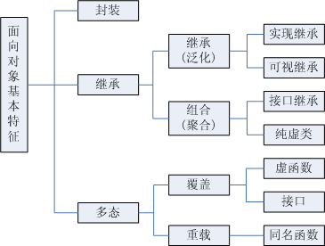

[TOC]

---
### [static]( http://www.cnblogs.com/yc_sunniwell/archive/2010/07/14/1777441.html )
#### 用法
1. 静态局部变量(对象)
    1) 存储在`静态存储区`而非`栈`上, (静态存储区所有字节都默认是0)
    2) 在程序第一次执行到定义处时生成, 直到整个程序结束时才释放,
    3) 但作用范围不变, 仍然只能在函数内访问.
2. 静态函数(内部函数)
    只能被本文件中的函数调用.
3. 类的静态成员和静态方法
    1) 类的静态成员函数和静态成员都属于整个`类`而非`类的对象`;
    2) 类的静态成员函数没有this指针, 只能访问类的`静态成员`和`静态方法`;
    2) 不能将静态成员函数定义为`虚函数`;
    3) 类的静态成员在类外初始化.

### 全局变量,静态全局变量,静态局部变量和局部变量的区别
1. 按存储区域分:
除`局部变量`存在`栈区`外, 其他三者存在`静态存储区`;
2. 按作用域分:
全局变量在整个工程文件内都有效;
静态全局变量只在定义它的文件内有效;
静态局部变量只在定义它的函数内有效, 只是程序仅分配一次内存, 函数返回后, 变量不会消失;
局部变量在定义它的函数内有效, 但是函数返回后失效。


---
### etern
* 用于扩展全局变量的作用域
#### 在一个文件内扩展
提前引用声明: 全局变量的作用范围是从定义点到文件结束, 因此如果想在定义点之前引用该全局变量, 则应该在引用之前用`extern`对其进行声明.

#### 在文件之间扩展
如果程序的两个文件都要用到同一个全局变量, 则要在一个文件中定义该全局变量, 而在另一个文件中用extern关键字声明该变量.

#### [extern "C"](http://www.cnblogs.com/xulei/archive/2006/11/12/558139.html )
> c++编译的时候，对函数名进行修饰，用于实现函数重载，而c里面没有这个，所以需要用extern “C” 在对头文件进行声明的时候加以区分。这个用于链接的时候进行函数名查找。

* 作为一中面向对象语言, c++支持函数重载, 而过程式的c则不支持. 因此, 函数被c++编译后在`符号库`中的名字与c是不同的: c++编译后的函数(`int sum(int, int)`)在符号库中的名字会包含参数类型(`_sum_int_int`), 而c的则不包含(`_sum`).


### 宏
略...

### volatile(易变的)
* 对于频繁使用的变量, 作为优化, 编译器会自动将其移到寄存器里, 使用的时候直接访问寄存器里的值(而非从内存中读取), 以加快存取速度.
* volatile用于告诉编译器该变量可能被操作系统,硬件,其他线程等编译器未知的因素更改. 让编译器不要对访问该变量进行优化,即, 每次都是从`内存`中读取数据并且在使用完后立即按原路保存到内存中.
* 问题: 一个变量能否同时被volatile和const修饰? 答案是肯定的. volatile是在告诉编译器该变量可能被`其他线程`等`外部因素`修改, 而const则表示在`程序内部`不应该去修改变量的值.

### const
1. 修饰普通变量和指针
```
const int* ptr = &a;    // 常量指针
*ptr = b; //内容不能改,
ptr = &b; //指向可以改

int* const ptr = &a;    // 指针常量
*ptr = b; //内容可以改
ptr = &b; //指向不能改
```

2. 修饰函数参数:
表示在函数体中不能修改参数的值
```
void func(const int a);
```

3. 修饰函数返回值:
```
const int* func();      //返回常量指针
int* const func();      //返回指针常量

```

4. 修饰成员函数:
表示成员函数不能修改任何成员变量, 也不能调用非const成员函数
```
void func(int a) const;
```

#### const 与 宏常量
* 宏常量没有类型, `没有类型安全检查`, 仅仅是在`预编译阶段`展开; const`有具体的类型`, 在`编译阶段`会执行类型安全检查.
* 从汇编的角度来看, const只给出对应的`内存地址`, 而宏常量给出的是`立即数`.


---
### new/delete 和 malloc/free
#### 概念
##### malloc/free
* malloc 分配指定`字节数`的内存空间, 如果分配成功则返回`void`类型的指针, 失败则返回空指针NULL. 返回的void指针要根据需要强制转换成指定类型.
* free 将有malloc分配的内存还给程序或者操作系统, malloc释放的是指针指向的内存但指针本身不会被删除,其中指针必须指向内存的首地址.

##### new/delete
* new 根据给定的类型分配合适的内存空间,并调用相关的构造函数构建对象,返回指定类型的指针. (其中获取内存空间是通过调用运算符`new`(即operator new)来实现的,operator new是可以被重载的)
* delete 用于释放由new分配的空间. 先调用相关类的析构函数,然后再释放内存.

#### 区别
1. malloc/free是c/c++语言的`标准库函数`, new/delete则是c++的运算符.
2. malloc需要指定要分配空间的大小, new能够自动计算所需空间的大小.
3. malloc不会对内存进初始化, new能够在分配的同时通过构造函数对内存进行初始化.
4. new/delete能够调用对象的构造函数和析构函数, 而malloc/free不能.

#### 联系
> 既然new/delete的功能完全覆盖了malloc/free，为什么C++还保留malloc/free呢？因为C++程序经常要调用C函数，而C程序只能用malloc/free管理动态内存。

#### 问题:
* new和malloc的区别
* 如果用free来是否一个new申请的空间会怎样?
如果用free释放“new创建的动态对象”，那么该对象因无法执行析构函数而可能导致程序出错。如果用delete释放“malloc申请的动态内存”，理论上讲程序不会出错，但是该程序的可读性很差。所以new/delete，malloc/free必须配对使用。
* 如果分配失败会怎样,分别会返回什么


---
### 内存管理

#### liunx进程地址空间布局

* 栈: 局部变量和函数调用, 大小有限
* 堆: 存放运行过程中被动态分配的内存段, 可动态伸缩
* bss段: 未初始化的静态变量和全局变量, bss段所有字节默认为0
* 数据(data)段: 已经初始化的全局变量和静态变量
* 代码(text)段: 可执行文件的操作指令, 只能不不能写

#### c++内存划分
* 栈: 局部变量, 函数返回指针
* 堆: malloc/free
* 自由存储区: new/delete, (通常位于堆上)
* 静态/全局存储区: static, (bss+data)
* 常量存储区: 字符串常量/const?, (部分text)


#### 问题
* 堆与栈区别, 栈的大小通常为多少?(<10M? or 1~2M?)


* [自由存储区是否等价于堆?](http://www.cnblogs.com/QG-whz/p/5060894.html)
堆是操作系统维护的一块内存, 而自由存储是C++中通过new与delete动态分配和释放对象的抽象概念, 因此堆与自由存储区并不等价. 如果是通过堆来实现自由存储, 则可以说new所申请的区域就在堆上.

* const修饰的变量在哪个区?
编译器通常不为普通const常量分配存储空间，而是将它们保存在`符号表`中，这使得它成为一个编译期间的常量，没有了存储与读内存的操作，使得它的效率也很高


### 结构体内存(字节)对齐
待续......


### 指针与引用的区别
* 定义: 指针本质是一个变量,指向一块内存的变量, 引用是一块内存(对象,变量)的别名.
* 指针可以为空, 可以通过赋不同的值来改变指针的指向,
* 引用不能为空, 只能初始化, 之后不能再被赋其他值.


### 指针与数组的区别
先看一段程序:
```c++
    char* arr0 = "aaaa";  //  warning: deprecated conversion from string constant to 'char*' [-Wwrite-strings]
    const char* arr = "aaaaa";  // sizeof(arr) => 4
    char arr2[] = "bbbbb";      // sizeof(arr2) => 6
    //arr[0] = 'c';   // error: assignment of read-only location '* arr'
    arr2[0] = 'c';  // ok
```
1. 数组**对应**着一块内存区域, 而指针**指向**一块内存区域.
2. 数组的地址和容量在运行期间不会改变, 而指针指向的内存的大小可以随时改变.
3. sizeof可以算出**数组的容量**, 却无法算出**指针所指内存的容量**.
4. 在进行参数传递时, 数组自动**退化**为同类型的指针.


### 递归与循环(迭代)的区别
1. 递归是自己调用自己, 因为是函数调用, 所以每次调用都需要进行现场的保存, 如果调用层次比较深则可能会出现栈溢出的情况.
2. 循环用变量的原值推出新值, 不会涉及到栈的操作, 内存开销相对较小.
3. 二者在有些场合可以互相转化.

### 常见面向对象设计模式
(见Design Pattern.md)

### 面向对象设计原则
(见Design Pattern.md)

### 面向对象的三个特性: 封住, 继承, 多态


[ref 1]( http://blog.csdn.net/jslmes/article/details/51914454 )
[ref 2]( http://blog.csdn.net/weiker12/article/details/9630423 )

#### 1. 封装
将数据(属性)和处理数据的方法进行绑定.
可以对一类事物进行封装, 也可以对接口进行封装.
> 通过将对象属性隐藏起来由方法进行访问控制，我们就为数据的操作提供了安全性、可扩展性、兼容性等很多好处。

#### 2. 继承
在封装的基础上实现属性和方法的**复用**.
将一般的属性和方法提取到父类中, 而将特殊的属性和方法方到子类中.

#### 3. 多态
> 多态，是一种动态绑定的函数调用方式，在运行时才能够确定调用哪个函数，而普通函数在编译时就已经被转换为一个固定的地址调用了。
* 在继承层次中, 可以通过指向子类的父类指针调用到子类的函数, 通过`虚函数表`实现.


### [c++对象内存布局]( http://www.cnblogs.com/QG-whz/p/4909359.html )
 *未完待续*
#### 虚函数表
* 每个`类`生成一个`虚函数`表, 表中存放着指向类中每个虚函数的函数指针.
* 每个`对象`有一个`虚表指针`指向类的虚函数表. 虚表指针通常放在类的最前端.

#### 非继承下的c++对象模型
* `静态`数据成员置于类对象`之外`, `非静态`数据成员被置于类对象`内`.
* `静态`与`非静态`函数也都放在类对象之外.
* `virtual`函数则通过`虚函数表`和`虚表指针`实现.

#### 单继承下的c++对象模型
* 子类新增的数据成员扩充到基类之后
* 若子类重写了基类的虚函数, 则子类的虚函数将覆盖虚函数表中对应的基类虚函数,
* 子类新生成的虚函数扩充到虚函数表最后

#### 多继承下的c++对象模型
* 子类的虚函数被放在声明的第一个基类的虚函数表中.
* 若子类重写的基类的函数, 则所有基类的同名函数都会被覆盖
* 内存布局中, 父类按其声明顺序排列

#### 虚继承下的c++对象模型
* 为了解决**菱形继承**中子类保留多个简介父类的多个实例的情况.
* 为子类新生成的虚函数另外生成一个虚函数表
* 子类单独保留基类的虚表指针与虚函数表

### STL中容器(vector, list, set, map, hashmap, queue, deque)底层实现
(见STL.md)


### 智能指针
------- 手动申请, 自动释放

> 智能指针(smart pointer)是存储指向动态分配（堆）对象指针的类，用于生存期控制，能够确保自动正确的销毁动态分配的对象，防止内存泄露。它的一种通用实现技术是使用引用计数(reference count)。智能指针类将一个计数器与类指向的对象相关联，引用计数跟踪该类有多少个对象共享同一指针。

* 弱引用 --- 主要是为了解决循环引用的问题, 在循环引用的情况下, 可以用`弱引用`来代替循环引用中的某个强引用, 从而将环打破

* [弱引用和强引用]( http://www.cnblogs.com/ZhangJinkun/p/4534545.html )
> 一个强引用当被引用的对象活着的话，这个引用也存在（就是说，当至少有一个强引用，那么这个对象就不能被释放）。share_ptr就是强引用。相对而言，弱引用当引用的对象活着的时候不一定存在。仅仅是当它存在的时候的一个引用。弱引用并不修改该对象的引用计数，这意味这弱引用它并不对对象的内存进行管理，在功能上类似于普通指针，然而一个比较大的区别是，弱引用能检测到所管理的对象是否已经被释放，从而避免访问非法内存。


### 其他

#### 一个程序在进入main函数之前会发生什么？
系统相关资源的初始化:
1. 设置栈指针
2. 初始化静态和全局变量, 全局类对象

* 如果想要在进入main函数之前执行一些操作, 可以将其放在全局类对象的构造函数中.

#### 析构函数能抛出异常吗?
不能, 也不应该抛出异常.
1. 如果析构函数抛出异常, 那么异常点之后的程序就不会被执行. 这样如果析构函数需要在异常点之后执行资源释放等必要操作, 那么这些操作就不会被执行, 从而造成内存泄露.
2. 通常在发生异常时,c++的异常处理机制会调用对象的析构函数释放资源, 如果析构函数本身也抛出异常, 则前一个异常还未处理又有新的异常, 造成程序崩溃. 

#### 内存泄漏

* 内存泄漏 --- 通常指`堆内存`泄漏, 由new/malloc申请的空间使用完后没有手动delete/free造成. 广义的说, 内存泄漏还包括`系统资源`的泄漏比如socket,interface,GDI Object等.

* 检测内存泄漏 --- 检测内存泄漏的关键是要截获对分配内存函数和释放内存函数的调用. 通过维护一个全局的list来跟踪每一块内存的声明周期, 每当成功分配一块内存后就把它的指针加入到全局的list中, 每当释放一块内存时在将其指针从list中删除. 这样当程序结束时list中剩余的指针就是没有被释放的内存.

##### linux检测内存泄漏
专门的工具


### 常见排序算法, 复杂度, 稳定性


## 编程题
给前序和中序求后序
字符串匹配O(m+n)
链表 环


面试套路:
 c++基础知识 ----> STL ----> 数据结构 ----> 编程题(算法)
