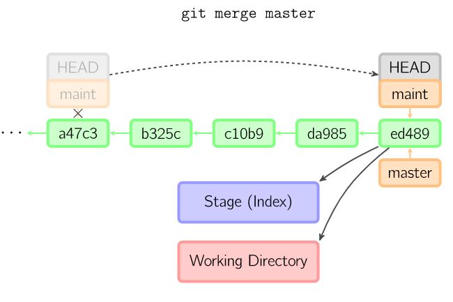
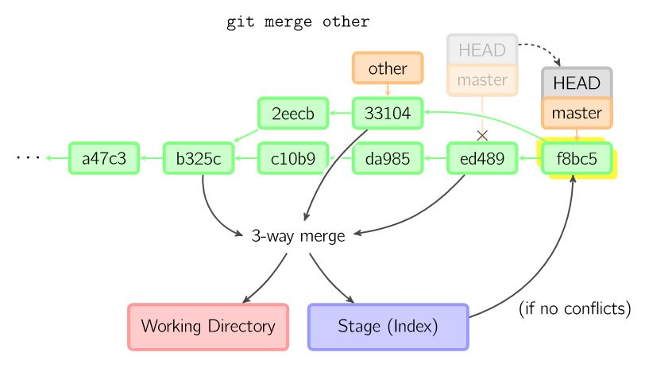
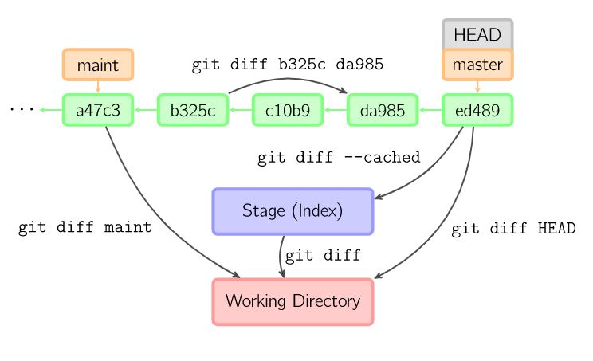

# git

[TOC]

## 总览
```
=============================================================================
||    |--------------->-------------->pull----------->------------>|       ||
||    |----->fetch/clone----->|------>reset---->|----->checkout--->|       ||
|| [Remote]             [Repository]          [Index]         [workspace]  ||
||    |<----<----push<----<---|<----commit<-----|<------add<-------|       ||
===========================================================================||
||	Remote:       远程仓库          Repository: 仓库区(本地仓库)        
||  Index/Stage:  暂存区            Workspace: 工作区                     
=============================================================================
```

---
## 基本操作

### Workspace --> Index
``` shell
$ git add <file1] <file2> #添加指定文件
$ git add <dir>           #添加指定目录，包括子目录
$ git add .               #添加当前目录
```

### Index ==> Workspace
```shell
$ git checkout -b <newBranch>               # 创建并切换分支
$ git checkout <branchName>                 # 切换当前分支
$ git checkout -b <newBranch> origin/master # 创建分支
```

### Index --> Repository
```shell
$ git commit -m "[message]"
$ git commit <file1><file2> -m "[message]"
$ git commit -a     #提交工作区自上次commit之后的变化到仓库区
```

### Repository ==> Index
```shell
$ git reset <commit_id>        # 只更新到Index
$ git reset --hard <commit_id> # 同时更新WorkSpace
```

### Repository --> Remote
``` shell
$ git push <远程主机名> <本地分支名>:<远程分支名>
```
* 将本地分支的更新推送至远程主机
* -u 参数：建立关联，通常第一次提交会用到

### Remote ==> Repository
```shell
$ git fetch <远程主机名>
$ git fetch <远程主机名> <分支名> #取回指定分支
```
* 将远程主机的更新取回本地,取回的代码对本地代码没有影响

### Remote ==> Workspace
```shell
$ git pull <远程主机名> <远程分支名>:<本地分支名>
```
* 取回某个分支，再与本地指定分支合并

---
## 分支操作

### git branch
```shell
$ git branch            # 查看分支(本地)
$ git branch -a         # 查看所有分支(远程+本地)
$ git branch <name>     # 创建分支
$ git branch -m <oldname> <newname>  # 重命名本地分支
$ git branch -d <name>  # 删除本地分支
$ git push --delete origin <branchname> # 删除远程分支
```

### git merge
```shell
$ git merge origin/<remoteBranchName>   # 在本地分支上合并远程分支
$ git merge <branchName>                # 合并指定分支到当前分支
```

|      fast-forward合并      |           三方合并            |
| :----------------------: | :-----------------------: |
|  |  |


### git diff


---
## 文件操作
``` shell
$ git ls-files                           # 查看已经追踪的文件文件
$ git log [--graph]                      # 查看commit_id
$ git mv <file-original> <file-renamed>  # 更改文件名
$ git log --pretty=oneline <filename>    # 查看某个文件的修改历史
$ git show <commit_id>                   # 查看某次提交所做的修改
```

### [git rm](https://git-scm.com/docs/git-rm)
* 删除文件
```
$ git rm <option> <file_name>
```

| option | usage |
|:--- |:--- |
| 没参数 | 同时删除工作区和暂存区 |
| -r | 递归删除(用于删除文件夹) |
| -f | force  |
| --cached | 只删除暂存区 |
| -q | quiet, 不需要确认 |


---
## 其他操作
### 配置
* 设置提交代码时的用户信息
```shell
$ git config [--global] user.name "name"
$ git config [--global] user.email "email"
```

### 新建仓库
1. 方法1
``` shell
$ git clone <版本库网址>
$ git clone <版本库网址> <本地目录>
$ git clone <版本库网址> -b <分支名>
```
* 从远程主机克隆一个版本库到本地

2. 方法2
```shell
$ git init <project-name> # 初始化本地仓库
$ git remote add git@github.com:<Repository-addr>/<username>.git # 关联远程库
$ git fetch
$ git checkout
```

### git remote
```shell
$ git remote -v                    # 列出所有远程主机
$ git remote show <主机名>          # 查看主机详细信息
$ git remote add <主机名> <网址>     # 添加远程主机
$ git remote rm <主机名>            # 删除远程主机
```

### [git stash](https://git-scm.com/book/zh/v1/Git-%E5%B7%A5%E5%85%B7-%E5%82%A8%E8%97%8F%EF%BC%88Stashing%EF%BC%89)
> “‘储藏”“可以获取你工作目录的中间状态——也就是你修改过的被追踪的文件和暂存的变更——并将它保存到一个未完结变更的堆栈中，随时可以重新应用。

```shell
$ git stash                      # 保存当前的工作进度，分别对Index和Workspae的状态进行保存
$ git stash save "<description>" # 保存当前工作环境, 并添加描述信息
$ git stash list                 # 查看现有储藏
$ git stash apply [stash@{<i>}]  # 应用指定的储藏,如果不指定则应用最后stash储藏
$ git stash drop stash@{<i>}     # 移除指定的储藏
$ git stash pop                  # 应用储藏并移除
```

---
## else
### [GitHub 第一坑：换行符自动转换](https://github.com/cssmagic/blog/issues/22 )
> warning: LF will be replaced by CRLF in...*

$ git config --global core.autocrlf false

### push策略---match v.s simple
* simple （Git 2.x 默认策略）
  $ git config --global push.default simple
> in centralized workflow, work like upstream with an added safety to refuse to push if the upstream branch’s name is different from the local one.
> push到同名分支

* upstream
  $ git config --global push.default upstream
> push the current branch back to the branch whose changes are usually integrated into the current branch (which is called @{upstream}). This mode only makes sense if you are pushing to the same repository you would normally pull from
> 即 从哪个分支pull下来就push回哪个分支

* mtching （Git 1.x 默认策略）
  $ git config --global push.default match
> push all branches having the same name on both ends.
> 本地所有分支都会被push上去

### [.gitignore not working](https://stackoverflow.com/questions/25436312/gitignore-not-working)
由于在添加ignore策略的时候被要被忽略的文件就已经在git中了, 所以需要手动将之后要被忽略的文件从git中删除(git rm命令).

### 明明配置了ssh key, 为什么每次push的时候还要输入密码 ?
#### git的访问方式
* git可以用ssh方式访问也可以用http方式. 前者只需要配置好ssh key就可以了, 而后者则每次都需要输入密码.
* 用`git remote`命令查看远程主机是htt地址还是ssh地址

## References

1. [图解git]( https://marklodato.github.io/visual-git-guide/index-zh-cn.html )
2. [廖雪峰 Git教程]( http://www.liaoxuefeng.com/wiki/0013739516305929606dd18361248578c67b8067c8c017b000/ )
3. [阮一峰 Git远程操作详解]( http://www.ruanyifeng.com/blog/2014/06/git_remote.html )
4. [阮一峰 常用 Git 命令清单]( http://www.ruanyifeng.com/blog/2015/12/git-cheat-sheet.html )
5. [6.3 Git 工具 - 储藏（Stashing）]( https://git-scm.com/book/zh/v1/Git-%E5%B7%A5%E5%85%B7-%E5%82%A8%E8%97%8F%EF%BC%88Stashing%EF%BC%89 )
