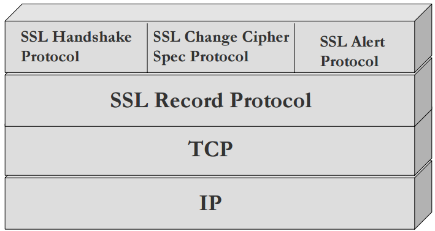
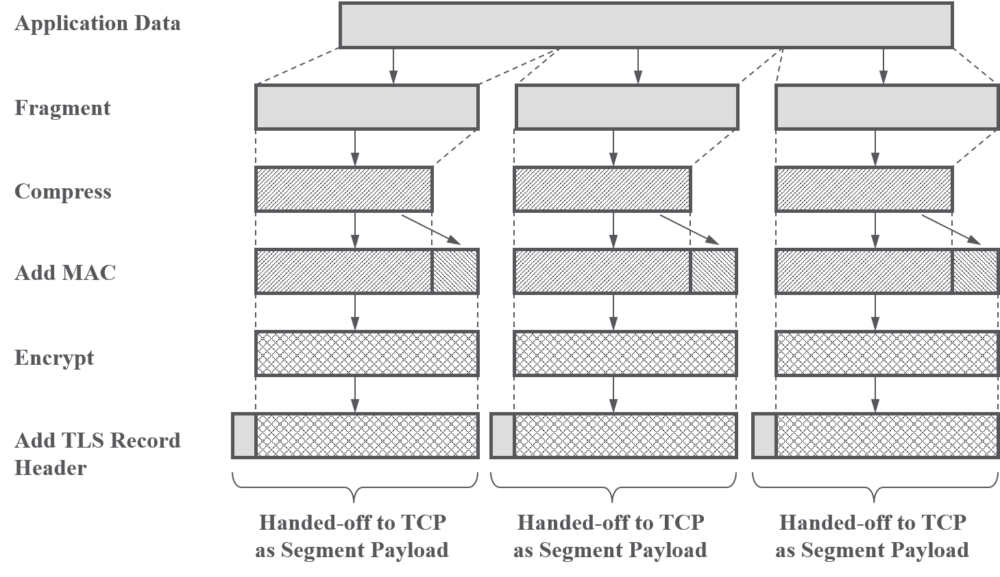
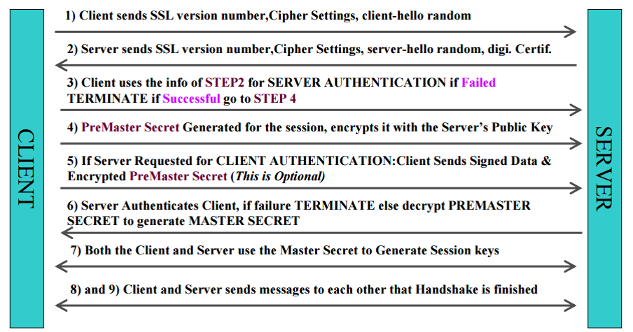
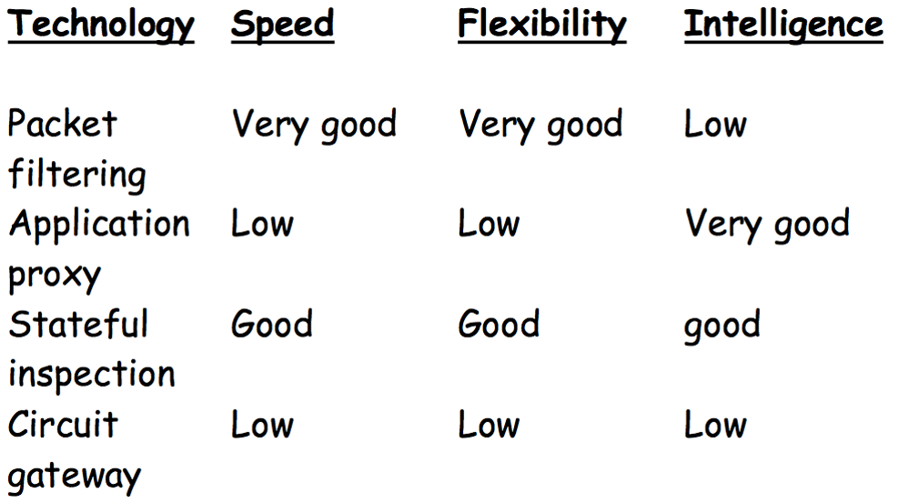
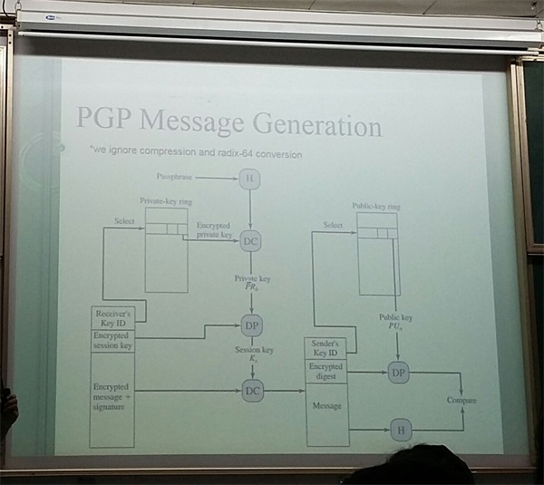

# 网络安全期末复习

## SSL (安全套接字)
### SSL架构


### SSL记录协议工作流程


#### SSL修改密文协议 
* 使用SSL记录协议服务的SSL高层协议的3个特定协议之一,也是其中最简单的一个。
* 协议由单个消息组成,该消息只包含一个值为1的单个字节。该消息的唯一作用就是使未决状态拷贝为当前状态,更新用于当前连接的密码组。
* 为了保障SSL传输过程的安全性,双方应该每隔一段时间改变加密规范。 

#### SSL告警协议 
* 为对等实体传递SSL的相关警告。如果在通信过程中某一方发现任何异常,就需要给对方发送一条警示消息通告。
* 警示消息有两种:
  一种是 Fatal错误,如传递数据过程中,发现错误的MAC,双方就需要立即中断会话,同时消除自己缓冲区相应的会话记录;
  第二种是Warning消息,这种情况,通信双方通常都只是记录日志,而对通信过程不造成任何影响。 

#### SSL握手协议
* 使得服务器和客户能够相互鉴别对方,协商具体的加密算法和MAC算法以及保密密钥,用来保护在SSL记录中发送的数据 
* SSL握手协议允许通信实体在交换应用数据之前协商密钥的算法、加密密钥和对客户端进行认证（可选）的协议，为下一步记录协议要使用的密钥信息进行协商，使客户端和服务器建立并保持安全通信的状态信息。SSL握手协议是在任何应用程序数据传输之前使用的。
* SSL握手协议包含四个阶段:
  第一个阶段建立安全能力;
  第二个阶段服务器鉴别和密钥交换;
  第三个阶段客户鉴别和密钥交换;
  第四个阶段完成握手协议。
  

---
## Firewall
### Packet Filtering Firewalls 
* The original firewall

* Works at the network level 

* Applies packet filters based on access rules 
  Source address

  Destination address

  Application or protocol 

  Source port number

  Destination port number 


### Circuit Level Firewalls 
* Circuit level gateways work at the session layer of the OSI model, or the TCP layer of TCP/IP 
* Monitor TCP handshaking between packets to determine whether a requested session is legitimate. 
* Do not permit an end-to-end TCP connection 
  Rather, the gateway sets up two TCP connections, one between itself and a TCP user on an inner host and one between itself and a TCP user on an outside host. 

  Once the two connections are established, the gateway typically relays TCP segments from one to the other without examining the contents 


### Application Gateway Firewalls (or proxy servers) 
* Similar to circuit-level gateways except that they are application specific. 
* Every connection between two networks is made via an application program called a proxy 
* Proxies are application or protocol specific 
* Only protocols that have specific proxies configured are allowed through the firewall; all other traffic is rejected. 


### Stateful Inspection Firewalls (dynamic packet filtering firewalls) 
* Third generation firewall technology, often referred to as dynamic packet filtering 
* Understands data in packets from the network layer (IP headers) up to the Application Layer 
* Tracks the state of communication sessions 

### General Performance


---
## Email
### [PGP](https://zh.wikipedia.org/wiki/PGP)
* 发送方
  

* 接收方
  

---
## 数论基础
### 基本概念
#### [群]( https://zh.wikipedia.org/wiki/%E7%BE%A4#.E4.BE.8B.E4.B8.80.EF.BC.9A.E6.95.B4.E6.95.B8 )
* 集合S + `一个`S上的二元运算oper
* oper应该满足的性质：封闭性、交换律、单位元、逆元

#### [环]( https://zh.wikipedia.org/wiki/%E7%8E%AF_(%E4%BB%A3%E6%95%B0) )  
* 集合R和定义于其上的二元运算`+`和`·`，(R ,  `+` ,  `·` )构成一个环，若它们满足：
1. (R, +)形成一个交换群，其单位元称为零元，记作`0`。
2. (R, ·)形成一个幺半群，即：(R, ·)是封闭的; (a·b)·c = a·(b·c); 1·a = a·1 = a。
3. 乘法关于加法满足分配律。

#### [域]( https://zh.wikipedia.org/wiki/%E5%9F%9F_(%E6%95%B8%E5%AD%B8) )
* 加法和乘法满足`封闭性`/ `结合律`/ `交换律`/  
* 满足`分配率`:  $ a * (b+c)= (a*b)+(a*c) $ 
* 存在加法单位元和乘法单位元
* 存在加法逆元,  非0元素存在乘法逆元


---
## RSA v.s. Elgamal 

### RSA
#### Euler's Totient Function(欧拉总计函数)
phi(p) = 小于p的正整数中与p互质的数目
> phi(p) = p-1  if p是质数
> phi(pq) = (p-1)*(q-1)

#### [RSA工作流程]( https://zh.wikipedia.org/wiki/RSA%E5%8A%A0%E5%AF%86%E6%BC%94%E7%AE%97%E6%B3%95 )
1. 生成公钥和私钥
* 随机选择两个大质数p、q，计算N = p*q 
* 求 r = phi(N) = (p-1)*(q-1)
* 选择一个e，使得 e<r 并且 gcd(e,r) = 1
* 求e关于r的模反元素d: d = e^-1^ mod r
* 公钥：(N,e)， 私钥：(N,d)
2. 加密消息 
   C = M^e^ mod N 
3. 解密消息
   M = C^d^ mod N 


### [Elgamal]( https://zh.wikipedia.org/wiki/ElGamal%E5%8A%A0%E5%AF%86%E7%AE%97%E6%B3%95 )
#### [循环群]( https://zh.wikipedia.org/wiki/%E5%BE%AA%E7%92%B0%E7%BE%A4 )
* 定义：设(G, \*)为一个群，若G内存在一个元素g使得 G={g^k^; k为整数}，则称G关于运算`*`形成一个循环群。

#### 加解密流程
1. 密钥生成
   p --  足够大的质数
   α -- p的一个原根(primitive root) ？？
   u -- 0<=u<=p-2
   β -- β = α^u^ mod p
   公钥：(p, α, β) 
   私钥：u

2. 加密 
   y1 = α^v^ mod p
   y2 = xβ^v^ mod p 
   v为一个随机数，x为明文，y1,y2为密文

3. 解密 
   $$ y_2 = x\beta^v\ mod\ p = x\alpha^{vu}\ mod\ p = xy_1^u\ mod\ p $$
   $$ 所以: x = y_2*(y_1^u)^{-1} mod\ p $$

#### 签名流程
<a href="http://www.iaeng.org/publication/WCECS2015/WCECS2015_pp115-118.pdf">ref</a>

1. 签名
   明文为 x
   选取一个随机数 r
   $ S_1 = \alpha^r\ mod\ p $
   $ S_2 = (x-u*S_1)*r^{-1}\ mod\ (p-1) $
   $ S_1,S_2 $作为x的签名
2. 验证
   $ V_1 = \alpha^x $
   $ V_2 = \beta^{S_1} * S_1^{S_2} $ 
   如果$V_1 = V_2$则验证成功

### RSA与Elgamal对比
相对于RSA，ElGamal计算量比较大，主要体现在验证和密钥生成过程。

ElGamal得到的签名的长度也比RSA的大一倍。ElGamal得到的签名由S1和S2两部分构成，而这两部分都分别要进行一个模幂运算。对于RSA，签名只需要一个模幂运算。

由于ElGamal每次加密都会用到一个随机数，因此即使使用相同的密钥对相同的明文进行加密每次得到的密文也是不相同的，而RSA则没有涉及到随机数，所以从这点来看ElGamal的安全性比较高。


## 作业题

* 求23-1 mod 34、29-1 mod 53、27-1 mod 71。

$ d = a*x + b*y, d=1 $
$ => a*x = 1 (mod b)  $
$ => a^{-1} mod b = x (即x为a在mod b 运算下的乘法逆元)  $

```c++
gcd (a,b){ //a>b
	if(b==0) return (a,1,0);
	(d’,x’,y’) = gcd(b,a%b);
	(d,x,y) = (d’, y’, x’-a/b*y’); //或者y = (d-ax)/b;
	return (d,x,y); // d = a*x + b*y
}
```

根据以上算法求得答案分别为：3，11，50


* 列举你所知道的密码体制类型，描述各自相应例子，阐述你如何理解密码技术在现实生活中的作用。

根据密钥的特点，现代密码体制可分为堆成密码体制和非对称密码体制两类。

例子：
  o 对称密码体制：DES，3DES，AES
  o 非对称密码体制：如RSA，ElGamal

作用： 保障信息在传输过程中的机密性和完整性，以及信息的不可否认性。


* 构造具有8个元素的有限域：给出域的各个元素，描述清楚域的加法运算和乘法运算。
  GF(2^3) 
  元素: $ a_2 x^2 + a_1 x + a_0 , 其中a_i = 0 或1$
  素多项式: $ x^3 + x + 1 $
  加法: 对应的项做`异或`
  乘法: 在进行正常多项式乘法后再模`素多项式`
  如, $ (x^2+x+1)(x^2+1) (mod(x^3+x+1)) = 1$
  因为: $ \cfrac{x^3+x}{x^3+x+1} =  \cfrac{(x^3+x+1)-1}{x^3+x+1} = 1 - \cfrac{1}{x^3+x+1}$ (异或中减即是加)


ref: http://blog.csdn.net/luotuo44/article/details/41645597


