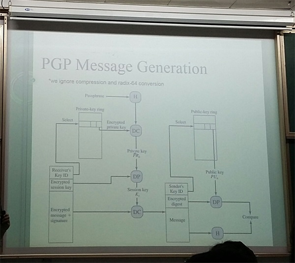

# 移动网络安全 (Mobile Network Security)
《大学计算机教育国外著名教材系列：密码学与网络安全（中文导读英文版）（影印版）》清华大学出版社 2009.

[TOC]


## 1 数论基础
### 基本概念
#### [群]( https://zh.wikipedia.org/wiki/%E7%BE%A4#.E4.BE.8B.E4.B8.80.EF.BC.9A.E6.95.B4.E6.95.B8 )
* 集合S + `一个`S上的二元运算oper
* oper应该满足的性质：封闭性、交换律、单位元、逆元

#### [环]( https://zh.wikipedia.org/wiki/%E7%8E%AF_(%E4%BB%A3%E6%95%B0) )  
* 集合R和定义于其上的二元运算`+`和`·`，(R ,  `+` ,  `·` )构成一个环，若它们满足：
1. (R, +)形成一个交换群，其单位元称为零元，记作`0`。
2. (R, ·)形成一个幺半群，即：(R, ·)是封闭的; (a·b)·c = a·(b·c); 1·a = a·1 = a。
3. 乘法关于加法满足分配律。

#### [域]( https://zh.wikipedia.org/wiki/%E5%9F%9F_(%E6%95%B8%E5%AD%B8) )
* 加法和乘法满足`封闭性`/ `结合律`/ `交换律`/  
* 满足`分配率`:  $ a * (b+c)= (a*b)+(a*c) $ 
* 存在加法单位元和乘法单位元
* 存在加法逆元,  非0元素存在乘法逆元

### 常见运算
* 单位元
  加法下的`0`，乘法下的`1`
* 逆元 
  加法下的`相反数`， 乘法下的`倒数`
* 异或(xor)：
  x xor x = 0
  x xor y = z => x = z xor y
* 离散对数(distributed logarithms)
  循环群

#### 模逆
$ a^{-1}\ mod\ b $

$ d = gcd(a,b) = a*x + b*y,  d=1 (a,b互质)  $
$ => a*x = 1\  (mod\ b) $
$ => a^{-1}\  (mod\  b) = x (即x为a在mod\  b 运算下的乘法逆元)  $

* 拓展欧几里得算法
```c++
extended_euclid (a,b){ //a>b
	if(b==0) return (a,1,0);
	(d’,x’,y’) = extended_euclid(b,a%b);
	(d,x,y) = (d’, y’, x’-a/b*y’); //或者y = (d-ax)/b;
	return (d,x,y); // d = a*x + b*y
}
```

#### 快速幂
```c++
int qPow(int A, int n){
    if (n == 0) return 1;
    int rslt = 1;
    while (n){
        if (n & 1){ //如果n为奇数
            rslt *= A;
        }
        A *= A;
        n >>= 1;
    }
    return rslt;
}
```

### 中国余数定理（孙子定理）
> 中国剩余定理是数论中的一个关于一元线性同余方程组的定理，说明了一元线性同余方程组有解的准则以及求解方法

* 一元线性同余方程组：
  $ x=a_1\ (mod\ m_1) $
  $ x=a_2\ (mod\ m_2) $
  $ ... $
  $ x=a_n\ (mod\ m_n) $

* 解法：
  1. $ M = m_1 * m_2 * ... * m_n $
  2. $ M_i = M/m_i $
  3. $ t_i = M_i^{-1}\ (mod\ m_i) $
  4. $ x = a_1 * t_1 * M_1 + a_2 * t_2 * M_2 + ... + a_n * t_n * M_n $

## 2 信息安全三要素
* Confidentiality (机密性)
  只有授权用户才能查看
* Integrity (完整性)
  未授权用户不能修改
  不可否认
* Availability (可用性)
  授权用户随时都可以访问

or 不可否认性

## 哈希函数
### MD5


### SHA-1


## 3 密码体制
### 3.1 对称密码
* 加解密使用同一密钥，或者加密密钥和解密密钥能互相推算
* 通信双方在通信之前要商定一个密钥
* 计算量小、算法公开、加密速度快、效率高
* 双方使用相同密钥，安全性难以保证
* 常见算法：DES、AES、RC4

#### Merkle’s puzzle

#### 流密码

* 速度快

#### 分组密码
> * 将明文分成多个等长的模块，使用确定的算法和对称密钥分别对每组进行加密和解密
> * 加密算法E和解密算法D互为反函数：x = D(E(x))

##### [模式]( https://xiaoxueying.gitbooks.io/graphic-cryptology/content/block_cipher_mode.html )
> 模式 ----- 加密长度超过分组长度的明文时所采用的迭代算法

1. ECB模式：Electronic CodeBook mode（电子密码模式）
   
* 将明文分组加密后直接作为密文分组， 简单
* 加解密都支持并行计算，速度快
* 明文分组与密文分组一一对应，不能很好的隐藏数据模式

2. CBC模式：Cipher Block Chaining mode（密码分组链接模式）
* 先将明文分组与前一个密文分组进行`XOR`运算，再加密（加密第一个明文分组时需要一个初始化向量）
  
* 明文中的重复排列不会反映在密文中
* 解密支持并行计算
* 加密不支持并行计算
* 明文块的误差会传递到之后的所有密文块

3. CFB模式：Cipher FeedBack mode（密文反馈模式）
* 将前一个`密文`分组`加密`后再与当前`明文`分组进行`XOR`运算得到当前密文分组
  
* 一种使用分组密码来实现流密码的方式
* 加密不支持并行计算
* 解密支持并行计算
* 误差传递

4. OFB模式：Output FeedBack mode（输出反馈模式）
> OFB模式不是通过密码算法对明文直接进行加密的，而是通过将明文分组和密码算法的输出进行XOR来产生密文分组的。 

 
* 将块密码变成同步的流密码
* 与其他流密码一样，密文中一个bit的翻转会使明文中对应位也产生翻转
* 加解密操作相同

5. CTR模式：CounTeR mode（计数器模式）
* 先将逐次累加的计数器进行加密再与当前明文分组进行`XOR`
  
* 加解密都支持并行计算
* 加解密使用同样的结构，容易实现
* 不会放大错误，当密文分组中有一个比特被翻转了，解密后明文分组中仅有与之对应的比特会被翻转

#### Feistel Network
 


### 3.2 非对称加密
* 需要两个密钥：公钥、私钥
* 公钥和私钥成对出现
* 通过公钥加密的密文只能用私钥解密，反之。
* 用途：
  o 信息保密，防止中间人攻击 --- 交换对称密钥
  o 身份验证和防止信息篡改 --- 数字签名
* 常见算法：RSA、ElGamal


## 数字签名
### 需求
1. 防伪、不可否认
2. 容易生成
3. 易于识别和验证
4. 难以伪造：无法根据签名伪造信息

### 常见签名方案
1. RSA
2. ElGamal

#### RSA、Elgamal对比
相对于RSA，ElGamal计算量比较大，主要体现在验证和密钥生成过程。

ElGamal得到的签名的长度也比RSA的大一倍。ElGamal得到的签名由S1和S2两部分构成，而这两部分都分别要进行一个模幂运算。对于RSA，签名只需要一个模幂运算。

由于ElGamal每次加密都会用到一个随机数，因此即使使用相同的密钥对相同的明文进行加密每次得到的密文也是不相同的，而RSA则没有涉及到随机数，所以从这点来看ElGamal的安全性比较高。


## [公钥基础设施(Public Key Infrastructure)]( http://www.enkichen.com/2016/04/12/certification-and-pki/ )
> PKI是一个标准，在这个标准之下发展出的为了实现安全基础服务目的的技术系统称为PKI

### CA
受信任的第三方
数字证书的签发机关，将用户的`公钥`和用户的`其他信息`捆绑在一起

### X.509标准
通用的证书格式


## 常见加密方案介绍

### 凯撒密码
* 替换密码

* 明文中的所有字母都在字母表上向后（或向前）按照一个固定数目进行偏移后被替换成密文

* 非常容易破解，而且应用中也无法保证通信安全


###  DES 
<a> link: http://blog.chinaunix.net/uid-29106641-id-4032988.html </a>

* 16级的feistel 网络
* 密钥长度 56bits
* 一个56bit的密钥生成16个48bit的轮密钥，用于每轮的feistel加密
  o 子密钥产生器：
* 输入 64bit，输出 64bit


### 3DES
* 3 次DES运算
  

### [AES(高级加密标准)]( https://zh.wikipedia.org/wiki/%E9%AB%98%E7%BA%A7%E5%8A%A0%E5%AF%86%E6%A0%87%E5%87%86#.E5.AF.86.E7.A0.81.E8.AF.B4.E6.98.8E )
* 比3DES更安全速度更快
  
  每轮循环包包含4个步骤：
1. MixColumns
   
   每一列的四个元素分别当做`1`,`x`,`x^2^`,`x^3`的系数然后和多项式`c(x)=3x^3 + x^2 + x + 2`在modulo `x^4+1`下相乘
2. SubBytes
   
   矩阵中的各字节通过一个8位的S-box进行转换
3. ShiftRows
   
   每一行都向左循环左移某个偏移量
4. AddRoundKey
   将RoundKey的每个byte与输入矩阵的对应byte进行异或

### RSA
#### Euler's Totient Function(欧拉总计函数)
phi(p) = 小于p的正整数中与p互质的数目
> phi(p) = p-1  if p是质数
> phi(pq) = (p-1)*(q-1)

#### [RSA工作流程]( https://zh.wikipedia.org/wiki/RSA%E5%8A%A0%E5%AF%86%E6%BC%94%E7%AE%97%E6%B3%95 )
1. 生成公钥和私钥
* 随机选择两个大质数p、q，计算N = p*q 
* 求 r = phi(N) = (p-1)*(q-1)
* 选择一个e，使得 e<r 并且 gcd(e,r) = 1
* 求e关于r的模反元素d: d = e^-1^ mod r
* 公钥：(N,e)， 私钥：(N,d)
2. 加密消息 
   C = M^e^ mod N 
3. 解密消息
   M = C^d^ mod N 


### [Elgamal]( https://zh.wikipedia.org/wiki/ElGamal%E5%8A%A0%E5%AF%86%E7%AE%97%E6%B3%95 )
#### [循环群]( https://zh.wikipedia.org/wiki/%E5%BE%AA%E7%92%B0%E7%BE%A4 )
* 定义：设(G, \*)为一个群，若G内存在一个元素g使得 G={g^k^; k为整数}，则称G关于运算`*`形成一个循环群。

#### 加解密流程
1. 密钥生成
   p --  足够大的质数
   α -- p的一个原根(primitive root) ？？
   u -- 0<=u<=p-2
   β -- β = α^u^ mod p
   公钥：(p, α, β) 
   私钥：u

2. 加密 
   y1 = α^v^ mod p
   y2 = xβ^v^ mod p 
   v为一个随机数，x为明文，y1,y2为密文

3. 解密 
   $$ y_2 = x\beta^v\ mod\ p = x\alpha^{vu}\ mod\ p = xy_1^u\ mod\ p $$
   $$ 所以: x = y_2*(y_1^u)^{-1} mod\ p $$

#### 签名流程
<a href="http://www.iaeng.org/publication/WCECS2015/WCECS2015_pp115-118.pdf">ref</a>

1. 签名
   明文为 x
   选取一个随机数 r
   $ S_1 = \alpha^r\ mod\ p $
   $ S_2 = (x-u*S_1)*r^{-1}\ mod\ (p-1) $
   $ S_1,S_2 $作为x的签名
2. 验证
   $ V_1 = \alpha^x $
   $ V_2 = \beta^{S_1} * S_1^{S_2} $ 
   如果$V_1 = V_2$则验证成功

---
## ...
### [PGP](https://zh.wikipedia.org/wiki/PGP)
* 发送方
  

* 接收方
  


